# erd.md

# Portfolio Dynamic Website - ERD & Data Flow

Dokumen ini menjelaskan rancangan **Entity Relationship Diagram (ERD)**, relasi database, dan alur data untuk portfolio dinamis berbasis **Next.js, Supabase PostgreSQL, Drizzle ORM, Tiptap Editor, Supabase Storage, dan Supabase Auth**.

Website memiliki kebutuhan utama:

- Public portfolio multi-page.
- Admin CMS single role.
- Bilingual content: ID dan EN.
- Design mode: Professional dan Playful.
- Draft dan publish content.
- SEO serius.
- Upload image/file.
- Analytics ringan.
- Guestbook dengan moderation.
- Contact message.

---

# 1. Database Design Goals

Database harus mendukung:

- Konten dinamis.
- Konten bilingual.
- Status draft/published/archived.
- Relasi project dengan tech stack.
- Relasi experience dengan tech stack.
- Rich text content dari Tiptap.
- SEO metadata per content.
- Upload media.
- Admin CMS.
- Analytics event.
- Guestbook moderation.
- Contact form.

---

# 2. High-Level ERD


```mermaid
erDiagram
    profiles ||--o{ resumes : owns
    profiles ||--o{ contact_messages : receives

    projects ||--o{ project_images : has
    projects ||--o{ project_technologies : uses
    technologies ||--o{ project_technologies : linked_to

    experiences ||--o{ experience_technologies : uses
    technologies ||--o{ experience_technologies : linked_to

    posts }o--|| post_categories : belongs_to

    case_studies ||--o{ case_study_images : has
    case_studies ||--o{ case_study_technologies : uses
    technologies ||--o{ case_study_technologies : linked_to

    playground_items ||--o{ playground_technologies : uses
    technologies ||--o{ playground_technologies : linked_to

    guestbook_entries }o--|| guestbook_statuses : has_status

    analytics_events }o--|| analytics_sessions : belongs_to
```

---

# 3. Main Entity Explanation

## 3.1 profiles

Menyimpan identitas utama pemilik portfolio.

Satu website hanya butuh satu profile utama, tapi tetap dibuat sebagai tabel agar fleksibel.

```txt
profiles
- id
- full_name
- username
- headline_id
- headline_en
- bio_id
- bio_en
- avatar_url
- email
- location
- github_url
- linkedin_url
- website_url
- availability_status
- created_at
- updated_at
```

### Flow

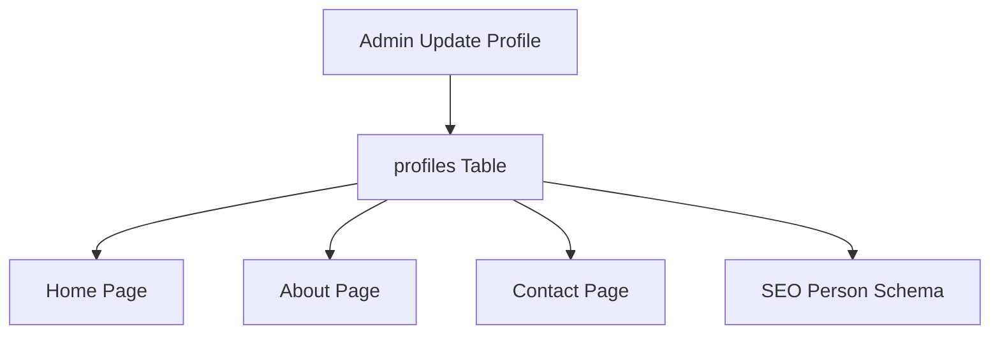
```mermaid
flowchart TD
    A[Admin Update Profile] --> B[profiles Table]
    B --> C[Home Page]
    B --> D[About Page]
    B --> E[Contact Page]
    B --> F[SEO Person Schema]
```

### Penjelasan

Data profile digunakan di banyak halaman:

- Home.
- About.
- Contact.
- Footer.
- Structured data Person schema.

---

## 3.2 resumes

Menyimpan file resume untuk setiap locale.

```txt
resumes
- id
- profile_id
- locale
- file_url
- version
- is_active
- uploaded_at
- created_at
- updated_at
```

Relasi:

```txt
profiles 1 - N resumes
```

### Flow

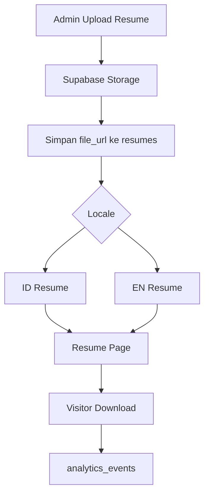
```mermaid
flowchart TD
    A[Admin Upload Resume] --> B[Supabase Storage]
    B --> C[Simpan file_url ke resumes]
    C --> D{Locale}
    D --> D1[ID Resume]
    D --> D2[EN Resume]
    D1 --> E[Resume Page]
    D2 --> E
    E --> F[Visitor Download]
    F --> G[analytics_events]
```

### Penjelasan

Resume dibuat terpisah antara ID dan EN supaya sesuai dengan route bahasa.

---

# 4. Project Entities

## 4.1 projects

Menyimpan data utama project.

```txt
projects
- id
- slug
- title_id
- title_en
- excerpt_id
- excerpt_en
- content_json_id
- content_json_en
- content_html_id
- content_html_en
- cover_image_url
- status
- featured
- project_type
- complexity
- started_at
- completed_at
- live_url
- repository_url
- seo_title_id
- seo_title_en
- seo_description_id
- seo_description_en
- published_at
- created_at
- updated_at
```

### Status

```txt
draft
published
archived
```

### Flow

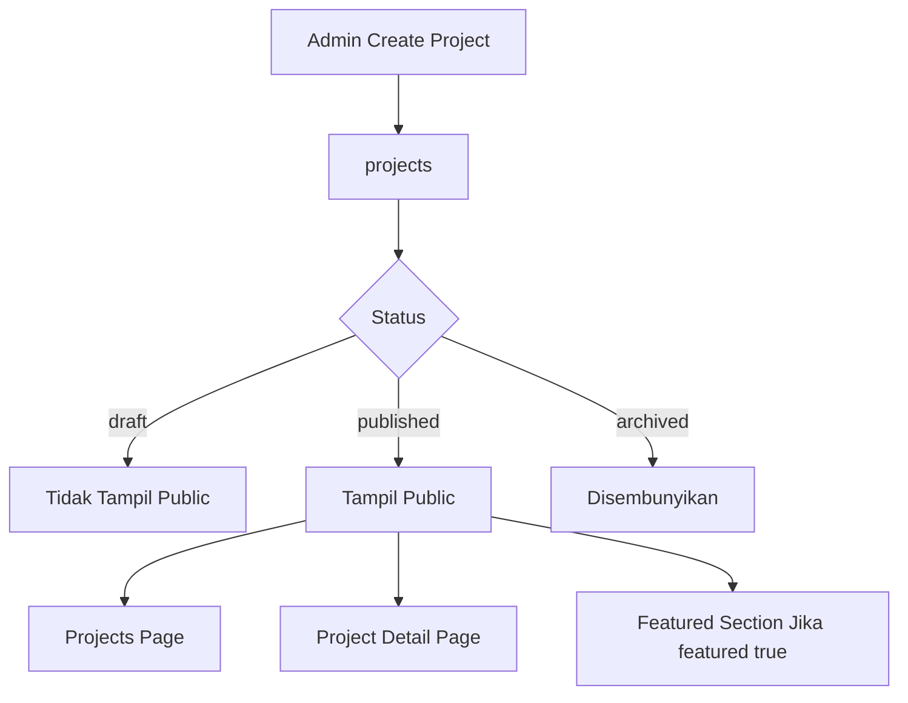
```mermaid
flowchart TD
    A[Admin Create Project] --> B[projects]
    B --> C{Status}
    C -->|draft| D[Tidak Tampil Public]
    C -->|published| E[Tampil Public]
    C -->|archived| F[Disembunyikan]

    E --> G[Projects Page]
    E --> H[Project Detail Page]
    E --> I[Featured Section Jika featured true]
```

---

## 4.2 project_images

Menyimpan gallery image untuk project.

```txt
project_images
- id
- project_id
- image_url
- alt_id
- alt_en
- caption_id
- caption_en
- sort_order
- created_at
```

Relasi:

```txt
projects 1 - N project_images
```

### Flow

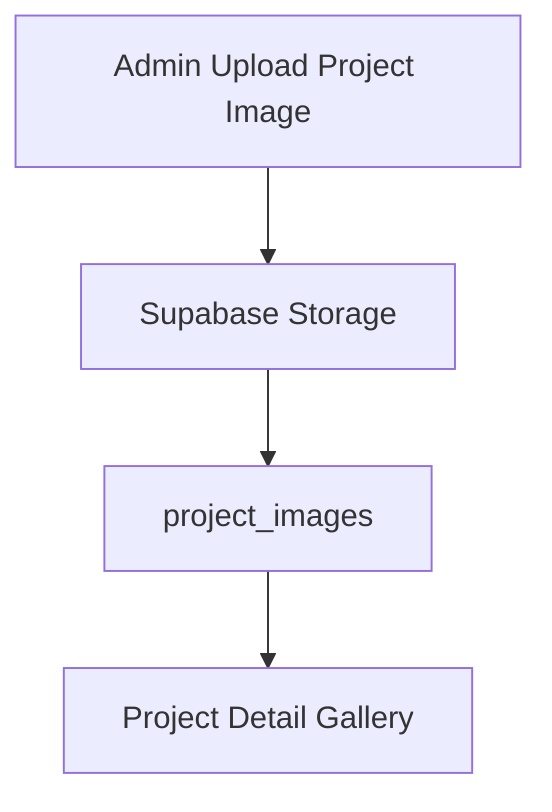
```mermaid
flowchart TD
    A[Admin Upload Project Image] --> B[Supabase Storage]
    B --> C[project_images]
    C --> D[Project Detail Gallery]
```

---

## 4.3 technologies

Menyimpan daftar teknologi.

```txt
technologies
- id
- name
- slug
- icon_url
- category
- color
- created_at
- updated_at
```

Kategori contoh:

```txt
frontend
backend
database
styling
testing
tooling
deployment
design
```

---

## 4.4 project_technologies

Pivot table untuk relasi many-to-many antara project dan technology.

```txt
project_technologies
- id
- project_id
- technology_id
```

Relasi:

```txt
projects N - N technologies
```

### Flow

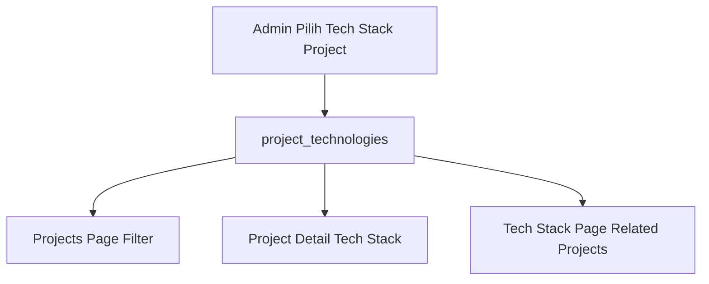
```mermaid
flowchart TD
    A[Admin Pilih Tech Stack Project] --> B[project_technologies]
    B --> C[Projects Page Filter]
    B --> D[Project Detail Tech Stack]
    B --> E[Tech Stack Page Related Projects]
```

---

# 5. Skills Entities

## 5.1 skills

Menyimpan skill utama.

```txt
skills
- id
- name
- slug
- category
- level
- icon_url
- description_id
- description_en
- featured
- sort_order
- created_at
- updated_at
```

Level bisa berupa:

```txt
beginner
intermediate
advanced
expert
```

Atau angka:

```txt
1 sampai 5
```

### Flow

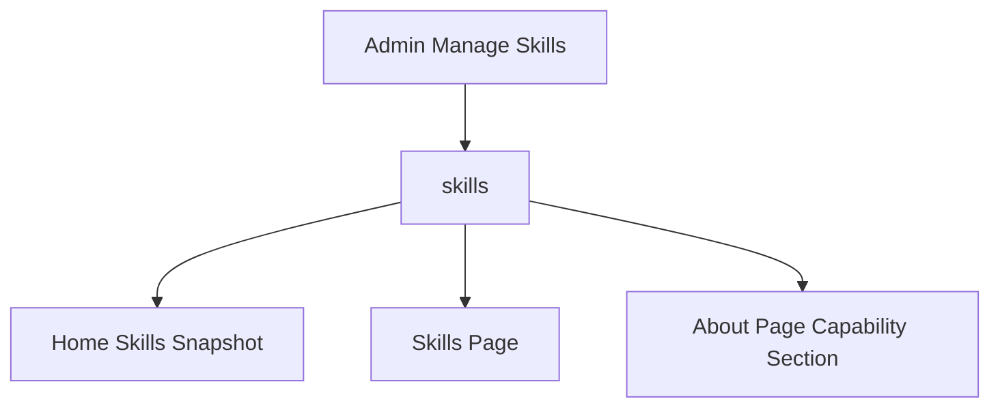
```mermaid
flowchart TD
    A[Admin Manage Skills] --> B[skills]
    B --> C[Home Skills Snapshot]
    B --> D[Skills Page]
    B --> E[About Page Capability Section]
```

---

# 6. Experience Entities

## 6.1 experiences

Menyimpan pengalaman kerja, organisasi, internship, freelance, atau pendidikan jika ingin digabung.

```txt
experiences
- id
- company
- role_id
- role_en
- employment_type
- location
- start_date
- end_date
- description_id
- description_en
- logo_url
- sort_order
- created_at
- updated_at
```

Employment type:

```txt
full_time
part_time
internship
freelance
organization
education
```

---

## 6.2 experience_technologies

Pivot table untuk teknologi yang digunakan dalam experience.

```txt
experience_technologies
- id
- experience_id
- technology_id
```

Relasi:

```txt
experiences N - N technologies
```

### Flow

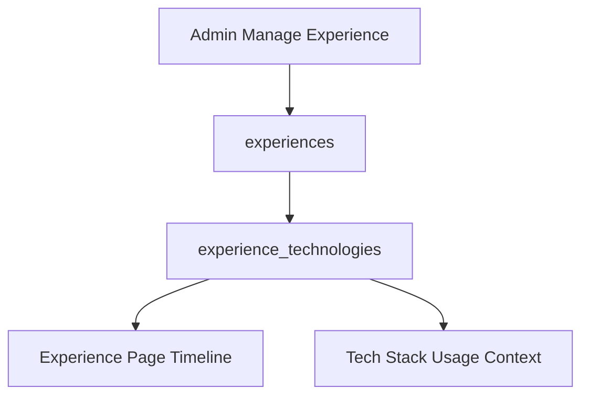
```mermaid
flowchart TD
    A[Admin Manage Experience] --> B[experiences]
    B --> C[experience_technologies]
    C --> D[Experience Page Timeline]
    C --> E[Tech Stack Usage Context]
```

---

# 7. Blog Entities

## 7.1 post_categories

Menyimpan kategori artikel.

```txt
post_categories
- id
- name_id
- name_en
- slug
- description_id
- description_en
- created_at
- updated_at
```

---

## 7.2 posts

Menyimpan blog/article.

```txt
posts
- id
- category_id
- slug
- title_id
- title_en
- excerpt_id
- excerpt_en
- content_json_id
- content_json_en
- content_html_id
- content_html_en
- cover_image_url
- status
- reading_time
- seo_title_id
- seo_title_en
- seo_description_id
- seo_description_en
- published_at
- created_at
- updated_at
```

Relasi:

```txt
post_categories 1 - N posts
```

### Flow

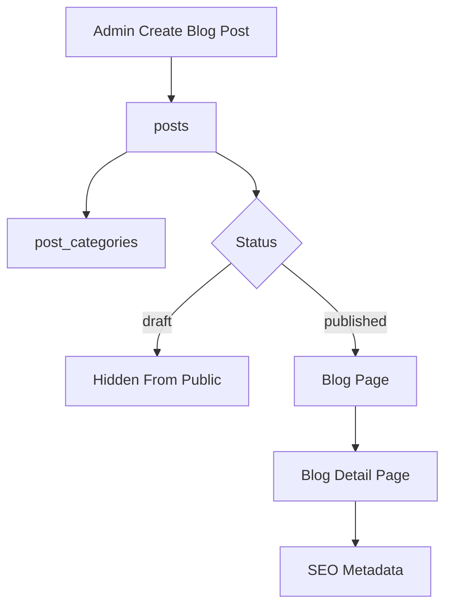
```mermaid
flowchart TD
    A[Admin Create Blog Post] --> B[posts]
    B --> C[post_categories]
    B --> D{Status}
    D -->|draft| E[Hidden From Public]
    D -->|published| F[Blog Page]
    F --> G[Blog Detail Page]
    G --> H[SEO Metadata]
```

### Penjelasan

Blog penting untuk SEO. Konten bisa berisi catatan teknis, studi kasus mini, dan dokumentasi belajar.

---

# 8. Case Study Entities

## 8.1 case_studies

Menyimpan studi kasus yang lebih mendalam daripada project biasa.

```txt
case_studies
- id
- slug
- title_id
- title_en
- excerpt_id
- excerpt_en
- content_json_id
- content_json_en
- content_html_id
- content_html_en
- cover_image_url
- client_or_context
- role
- status
- featured
- seo_title_id
- seo_title_en
- seo_description_id
- seo_description_en
- published_at
- created_at
- updated_at
```

---

## 8.2 case_study_images

```txt
case_study_images
- id
- case_study_id
- image_url
- alt_id
- alt_en
- caption_id
- caption_en
- sort_order
- created_at
```

---

## 8.3 case_study_technologies

```txt
case_study_technologies
- id
- case_study_id
- technology_id
```

Relasi:

```txt
case_studies N - N technologies
```

### Flow

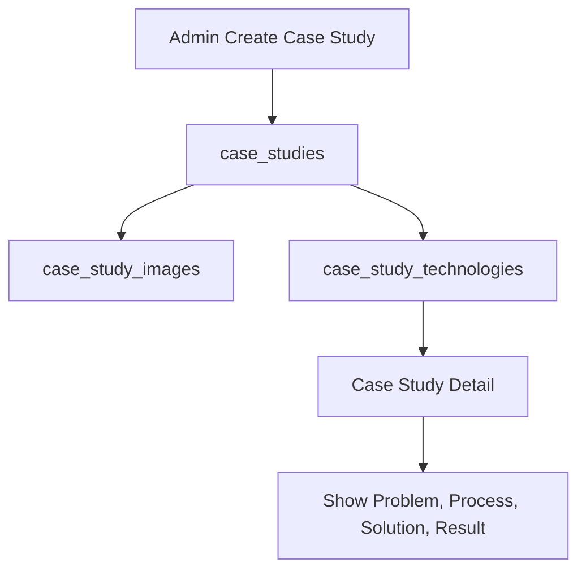
```mermaid
flowchart TD
    A[Admin Create Case Study] --> B[case_studies]
    B --> C[case_study_images]
    B --> D[case_study_technologies]
    D --> E[Case Study Detail]
    E --> F[Show Problem, Process, Solution, Result]
```

---

# 9. Playground Entities

## 9.1 playground_items

Menyimpan eksperimen UI yang hanya tampil di Playful Mode.

```txt
playground_items
- id
- slug
- title
- description
- component_key
- thumbnail_url
- category
- status
- complexity
- created_at
- updated_at
```

### Field `component_key`

`component_key` dipakai untuk mapping ke komponen frontend tertentu.

Contoh:

```txt
magnetic-button
animated-tabs
drag-card
gradient-orb
command-menu-demo
```

---

## 9.2 playground_technologies

```txt
playground_technologies
- id
- playground_item_id
- technology_id
```

Relasi:

```txt
playground_items N - N technologies
```

### Flow

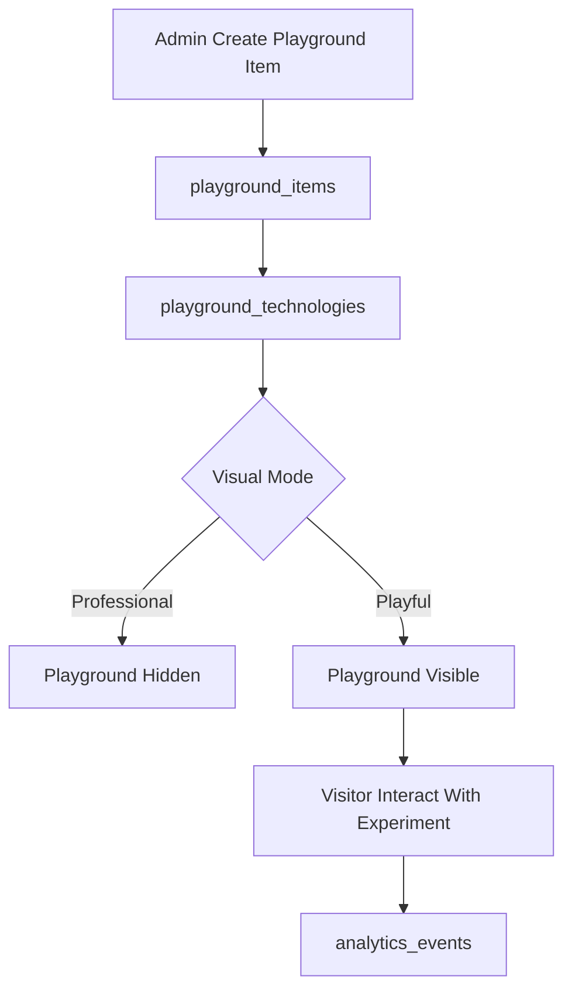
```mermaid
flowchart TD
    A[Admin Create Playground Item] --> B[playground_items]
    B --> C[playground_technologies]
    C --> D{Visual Mode}
    D -->|Professional| E[Playground Hidden]
    D -->|Playful| F[Playground Visible]
    F --> G[Visitor Interact With Experiment]
    G --> H[analytics_events]
```

---

# 10. Contact Entities

## 10.1 contact_messages

Menyimpan pesan dari contact form.

```txt
contact_messages
- id
- name
- email
- subject
- purpose
- message
- read_at
- created_at
```

Purpose:

```txt
job_opportunity
freelance_project
collaboration
general
```

### Flow

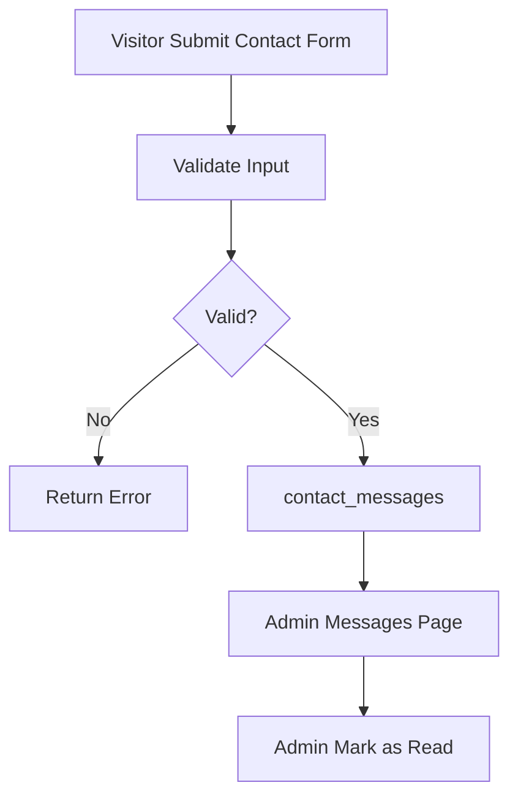
```mermaid
flowchart TD
    A[Visitor Submit Contact Form] --> B[Validate Input]
    B --> C{Valid?}
    C -->|No| D[Return Error]
    C -->|Yes| E[contact_messages]
    E --> F[Admin Messages Page]
    F --> G[Admin Mark as Read]
```

---

# 11. Guestbook Entities

## 11.1 guestbook_statuses

Reference table untuk status guestbook.

```txt
guestbook_statuses
- id
- name
```

Isi:

```txt
pending
approved
rejected
```

---

## 11.2 guestbook_entries

```txt
guestbook_entries
- id
- name
- message
- website_url
- status_id
- approved_at
- created_at
```

Relasi:

```txt
guestbook_statuses 1 - N guestbook_entries
```

### Flow

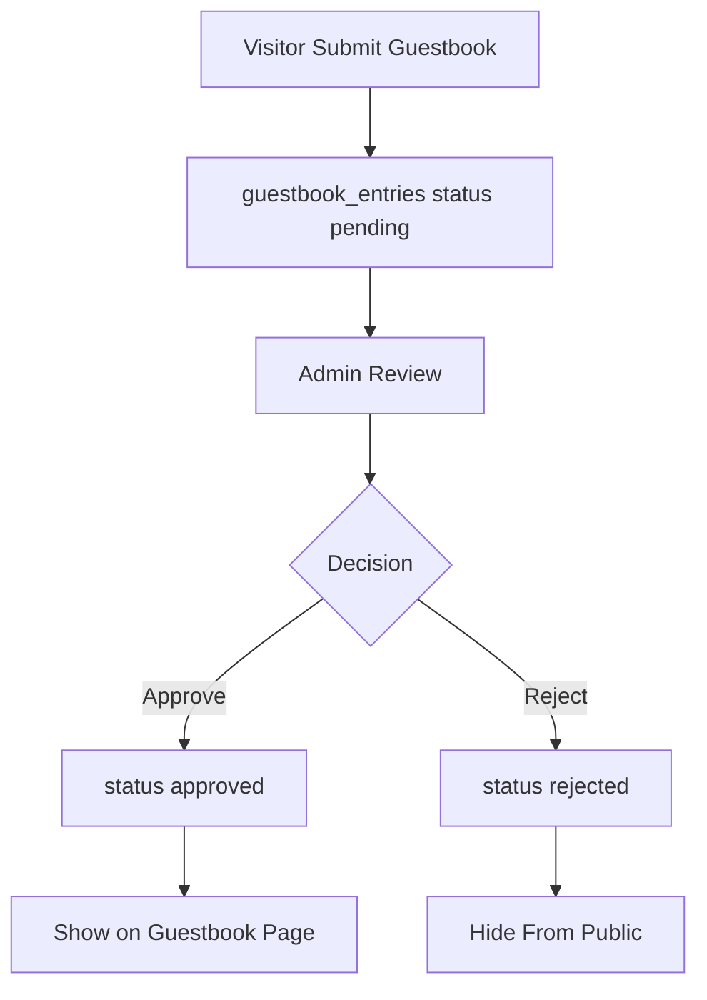
```mermaid
flowchart TD
    A[Visitor Submit Guestbook] --> B[guestbook_entries status pending]
    B --> C[Admin Review]
    C --> D{Decision}
    D -->|Approve| E[status approved]
    D -->|Reject| F[status rejected]
    E --> G[Show on Guestbook Page]
    F --> H[Hide From Public]
```

---

# 12. Analytics Entities

## 12.1 analytics_sessions

Menyimpan session anonim visitor.

```txt
analytics_sessions
- id
- session_key
- user_agent
- referrer
- country
- created_at
```

Catatan:

- Hindari menyimpan data personal berlebihan.
- Untuk MVP, cukup anonymized session.

---

## 12.2 analytics_events

Menyimpan event aktivitas user.

```txt
analytics_events
- id
- session_id
- event_name
- path
- metadata
- created_at
```

Event name contoh:

```txt
page_view
project_view
blog_view
case_study_view
resume_download
contact_submit
guestbook_submit
theme_switch
locale_switch
external_link_click
```

Relasi:

```txt
analytics_sessions 1 - N analytics_events
```

### Flow

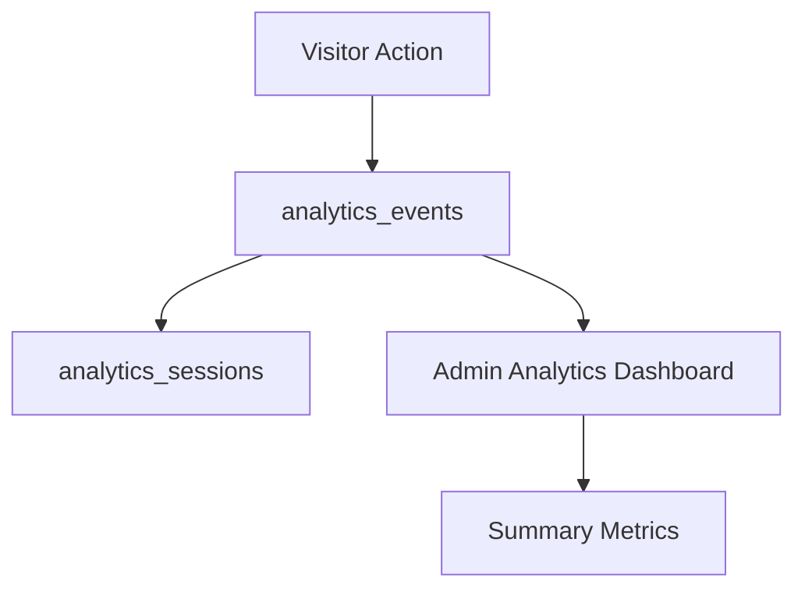
```mermaid
flowchart TD
    A[Visitor Action] --> B[analytics_events]
    B --> C[analytics_sessions]
    B --> D[Admin Analytics Dashboard]
    D --> E[Summary Metrics]
```

---

# 13. Media Storage Flow

Media tidak disimpan langsung di database. Database hanya menyimpan URL/path file.

## 13.1 Storage Buckets

```txt
avatars
projects
blogs
case-studies
playground
resumes
general
```

## 13.2 Media Flow

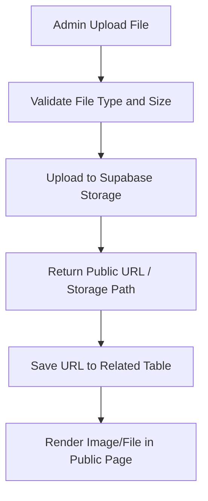
```mermaid
flowchart TD
    A[Admin Upload File] --> B[Validate File Type and Size]
    B --> C[Upload to Supabase Storage]
    C --> D[Return Public URL / Storage Path]
    D --> E[Save URL to Related Table]
    E --> F[Render Image/File in Public Page]
```

### Penjelasan

Gambar dan resume disimpan di Supabase Storage. Database hanya menyimpan URL atau path. Ini lebih efisien dan waras. Menyimpan file binary langsung di row database untuk portfolio pribadi adalah cara cepat membuat masa depan diri sendiri menderita.

---

# 14. Full ERD Detail


```mermaid
erDiagram
    profiles {
        uuid id PK
        string full_name
        string username
        text headline_id
        text headline_en
        text bio_id
        text bio_en
        string avatar_url
        string email
        string location
        string github_url
        string linkedin_url
        string website_url
        string availability_status
        timestamp created_at
        timestamp updated_at
    }

    resumes {
        uuid id PK
        uuid profile_id FK
        string locale
        string file_url
        string version
        boolean is_active
        timestamp uploaded_at
        timestamp created_at
        timestamp updated_at
    }

    projects {
        uuid id PK
        string slug
        string title_id
        string title_en
        text excerpt_id
        text excerpt_en
        json content_json_id
        json content_json_en
        text content_html_id
        text content_html_en
        string cover_image_url
        string status
        boolean featured
        string project_type
        string complexity
        date started_at
        date completed_at
        string live_url
        string repository_url
        string seo_title_id
        string seo_title_en
        text seo_description_id
        text seo_description_en
        timestamp published_at
        timestamp created_at
        timestamp updated_at
    }

    project_images {
        uuid id PK
        uuid project_id FK
        string image_url
        string alt_id
        string alt_en
        string caption_id
        string caption_en
        int sort_order
        timestamp created_at
    }

    technologies {
        uuid id PK
        string name
        string slug
        string icon_url
        string category
        string color
        timestamp created_at
        timestamp updated_at
    }

    project_technologies {
        uuid id PK
        uuid project_id FK
        uuid technology_id FK
    }

    skills {
        uuid id PK
        string name
        string slug
        string category
        string level
        string icon_url
        text description_id
        text description_en
        boolean featured
        int sort_order
        timestamp created_at
        timestamp updated_at
    }

    experiences {
        uuid id PK
        string company
        string role_id
        string role_en
        string employment_type
        string location
        date start_date
        date end_date
        text description_id
        text description_en
        string logo_url
        int sort_order
        timestamp created_at
        timestamp updated_at
    }

    experience_technologies {
        uuid id PK
        uuid experience_id FK
        uuid technology_id FK
    }

    post_categories {
        uuid id PK
        string name_id
        string name_en
        string slug
        text description_id
        text description_en
        timestamp created_at
        timestamp updated_at
    }

    posts {
        uuid id PK
        uuid category_id FK
        string slug
        string title_id
        string title_en
        text excerpt_id
        text excerpt_en
        json content_json_id
        json content_json_en
        text content_html_id
        text content_html_en
        string cover_image_url
        string status
        int reading_time
        string seo_title_id
        string seo_title_en
        text seo_description_id
        text seo_description_en
        timestamp published_at
        timestamp created_at
        timestamp updated_at
    }

    case_studies {
        uuid id PK
        string slug
        string title_id
        string title_en
        text excerpt_id
        text excerpt_en
        json content_json_id
        json content_json_en
        text content_html_id
        text content_html_en
        string cover_image_url
        string client_or_context
        string role
        string status
        boolean featured
        string seo_title_id
        string seo_title_en
        text seo_description_id
        text seo_description_en
        timestamp published_at
        timestamp created_at
        timestamp updated_at
    }

    case_study_images {
        uuid id PK
        uuid case_study_id FK
        string image_url
        string alt_id
        string alt_en
        string caption_id
        string caption_en
        int sort_order
        timestamp created_at
    }

    case_study_technologies {
        uuid id PK
        uuid case_study_id FK
        uuid technology_id FK
    }

    playground_items {
        uuid id PK
        string slug
        string title
        text description
        string component_key
        string thumbnail_url
        string category
        string status
        string complexity
        timestamp created_at
        timestamp updated_at
    }

    playground_technologies {
        uuid id PK
        uuid playground_item_id FK
        uuid technology_id FK
    }

    contact_messages {
        uuid id PK
        string name
        string email
        string subject
        string purpose
        text message
        timestamp read_at
        timestamp created_at
    }

    guestbook_statuses {
        uuid id PK
        string name
    }

    guestbook_entries {
        uuid id PK
        string name
        text message
        string website_url
        uuid status_id FK
        timestamp approved_at
        timestamp created_at
    }

    analytics_sessions {
        uuid id PK
        string session_key
        string user_agent
        string referrer
        string country
        timestamp created_at
    }

    analytics_events {
        uuid id PK
        uuid session_id FK
        string event_name
        string path
        json metadata
        timestamp created_at
    }

    profiles ||--o{ resumes : owns
    projects ||--o{ project_images : has
    projects ||--o{ project_technologies : uses
    technologies ||--o{ project_technologies : used_by
    skills }o--o{ technologies : conceptually_related
    experiences ||--o{ experience_technologies : uses
    technologies ||--o{ experience_technologies : used_by
    post_categories ||--o{ posts : categorizes
    case_studies ||--o{ case_study_images : has
    case_studies ||--o{ case_study_technologies : uses
    technologies ||--o{ case_study_technologies : used_by
    playground_items ||--o{ playground_technologies : uses
    technologies ||--o{ playground_technologies : used_by
    guestbook_statuses ||--o{ guestbook_entries : status_of
    analytics_sessions ||--o{ analytics_events : has
```

---

# 15. Data Flow by Page

## 15.1 Home Page Data Flow

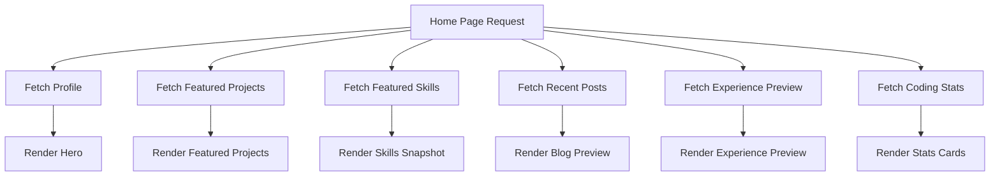
```mermaid
flowchart TD
    A[Home Page Request] --> B[Fetch Profile]
    A --> C[Fetch Featured Projects]
    A --> D[Fetch Featured Skills]
    A --> E[Fetch Recent Posts]
    A --> F[Fetch Experience Preview]
    A --> G[Fetch Coding Stats]

    B --> H[Render Hero]
    C --> I[Render Featured Projects]
    D --> J[Render Skills Snapshot]
    E --> K[Render Blog Preview]
    F --> L[Render Experience Preview]
    G --> M[Render Stats Cards]
```

---

## 15.2 Projects Page Data Flow

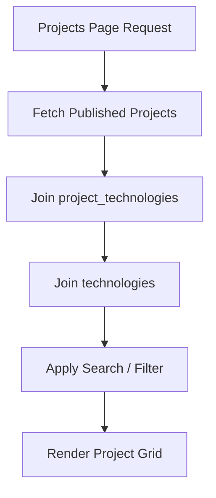
```mermaid
flowchart TD
    A[Projects Page Request] --> B[Fetch Published Projects]
    B --> C[Join project_technologies]
    C --> D[Join technologies]
    D --> E[Apply Search / Filter]
    E --> F[Render Project Grid]
```

---

## 15.3 Project Detail Data Flow

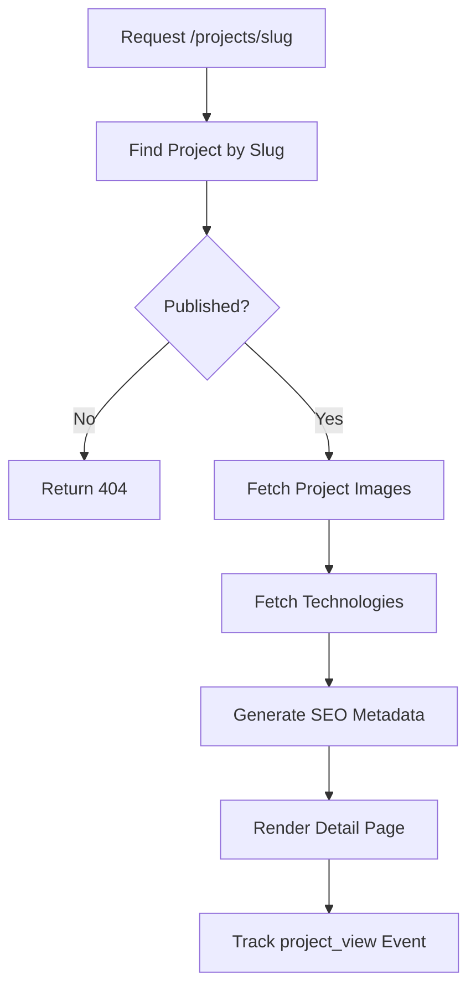
```mermaid
flowchart TD
    A[Request /projects/slug] --> B[Find Project by Slug]
    B --> C{Published?}
    C -->|No| D[Return 404]
    C -->|Yes| E[Fetch Project Images]
    E --> F[Fetch Technologies]
    F --> G[Generate SEO Metadata]
    G --> H[Render Detail Page]
    H --> I[Track project_view Event]
```

---

## 15.4 Blog Detail Data Flow

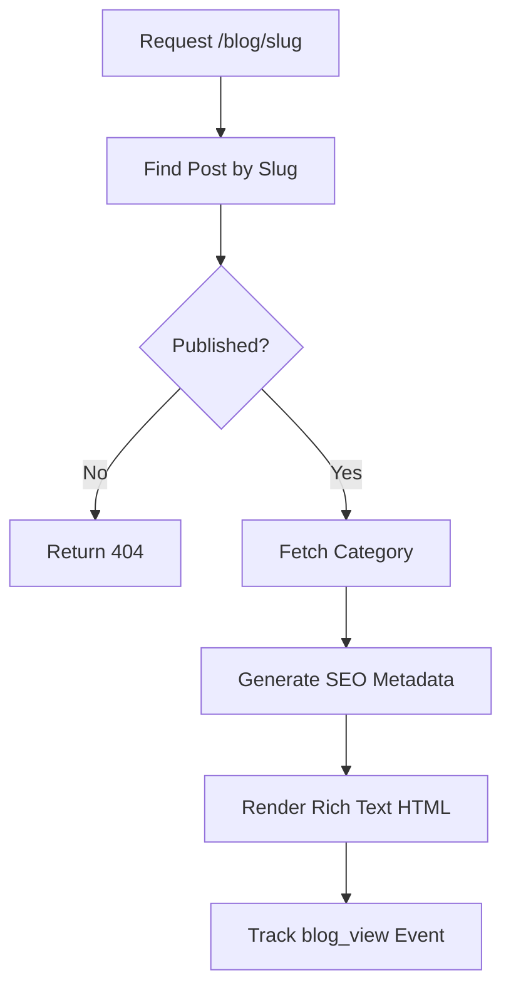
```mermaid
flowchart TD
    A[Request /blog/slug] --> B[Find Post by Slug]
    B --> C{Published?}
    C -->|No| D[Return 404]
    C -->|Yes| E[Fetch Category]
    E --> F[Generate SEO Metadata]
    F --> G[Render Rich Text HTML]
    G --> H[Track blog_view Event]
```

---

## 15.5 Admin Content Edit Data Flow

```mermaid
flowchart TD
    A[Admin Opens Edit Page] --> B[Check Auth]
    B --> C{Authorized?}
    C -->|No| D[Redirect Login]
    C -->|Yes| E[Fetch Existing Content]

    E --> F[Load Tiptap Editor]
    F --> G[Admin Edits Content]
    G --> H[Submit Form]
    H --> I[Validate with Zod]
    I --> J{Valid?}
    J -->|No| K[Show Field Errors]
    J -->|Yes| L[Save to Database]

    L --> M{Published?}
    M -->|No| N[Keep Draft]
    M -->|Yes| O[Revalidate Public Route]
```

---

# 16. Content Localization Strategy

Ada dua pendekatan:

## 16.1 Current Recommended Approach

Satu row berisi field ID dan EN.

Contoh:

```txt
title_id
title_en
excerpt_id
excerpt_en
content_html_id
content_html_en
```

Kelebihan:

- Lebih simpel.
- Cocok untuk single-admin portfolio.
- Query lebih mudah.
- Admin form bisa menampilkan tab ID/EN.

Kekurangan:

- Kalau nanti mendukung banyak bahasa tambahan, struktur bisa membesar.

## 16.2 Alternative Scalable Approach

Gunakan translation table:

```txt
project_translations
- id
- project_id
- locale
- title
- excerpt
- content_json
- content_html
```

Kelebihan:

- Lebih scalable untuk banyak bahasa.
- Lebih clean secara normalisasi.

Kekurangan:

- Query lebih kompleks.
- Untuk portfolio pribadi bisa terasa berlebihan.

## 16.3 Recommendation

Untuk sekarang gunakan pendekatan field ID/EN langsung di tabel utama. Lebih praktis dan cukup scalable untuk kebutuhan portfolio.

Tidak semua hal perlu dibuat seperti sistem enterprise. Kadang database simpel itu bukan dosa, itu tanda masih ada akal sehat.

---

# 17. Status Flow

Semua konten utama menggunakan status:

```txt
draft
published
archived
```

Konten utama:

- projects.
- posts.
- case_studies.
- playground_items.

```mermaid
stateDiagram-v2
    [*] --> draft
    draft --> published
    published --> archived
    archived --> draft
    archived --> published
    published --> draft
```

### Penjelasan

- `draft`: konten belum tampil publik.
- `published`: konten tampil publik.
- `archived`: konten disembunyikan tapi tidak dihapus.

---

# 18. Recommended Indexes

Untuk performa query:

```sql
CREATE INDEX idx_projects_slug ON projects(slug);
CREATE INDEX idx_projects_status ON projects(status);
CREATE INDEX idx_projects_featured ON projects(featured);

CREATE INDEX idx_posts_slug ON posts(slug);
CREATE INDEX idx_posts_status ON posts(status);
CREATE INDEX idx_posts_category_id ON posts(category_id);

CREATE INDEX idx_case_studies_slug ON case_studies(slug);
CREATE INDEX idx_case_studies_status ON case_studies(status);

CREATE INDEX idx_technologies_slug ON technologies(slug);
CREATE INDEX idx_skills_featured ON skills(featured);

CREATE INDEX idx_contact_messages_created_at ON contact_messages(created_at);
CREATE INDEX idx_guestbook_entries_status_id ON guestbook_entries(status_id);

CREATE INDEX idx_analytics_events_event_name ON analytics_events(event_name);
CREATE INDEX idx_analytics_events_created_at ON analytics_events(created_at);
CREATE INDEX idx_analytics_events_path ON analytics_events(path);
```

---

# 19. RLS and Security Flow

## 19.1 Public Read

Public hanya boleh membaca data dengan status `published`.

```txt
projects.status = 'published'
posts.status = 'published'
case_studies.status = 'published'
playground_items.status = 'published'
guestbook_entries.status = 'approved'
```

## 19.2 Admin Write

Hanya admin yang boleh:

- Insert.
- Update.
- Delete.
- Publish.
- Upload media.
- Moderasi guestbook.
- Membaca contact messages.

## 19.3 Security Flow

```mermaid
flowchart TD
    A[Request Database] --> B{Request Type}
    B --> B1[Public Read]
    B --> B2[Admin Mutation]

    B1 --> C[Check Published Status]
    C --> D{Allowed?}
    D -->|Yes| E[Return Data]
    D -->|No| F[Reject / Empty Result]

    B2 --> G[Check Supabase Auth]
    G --> H{Is Admin?}
    H -->|Yes| I[Allow Mutation]
    H -->|No| J[Reject Request]
```

---

# 20. Recommended Drizzle Schema Grouping

Struktur schema file:

```txt
src/lib/db/schema/
├─ profile.ts
├─ resume.ts
├─ project.ts
├─ technology.ts
├─ skill.ts
├─ experience.ts
├─ post.ts
├─ case-study.ts
├─ playground.ts
├─ contact.ts
├─ guestbook.ts
├─ analytics.ts
└─ index.ts
```

Ini menjaga schema tetap modular. Kalau semua schema dimasukkan satu file, nanti file itu tumbuh seperti monster yang memakan kewarasan.

---

# 21. Final Database Principle

Database ini sebaiknya mengikuti prinsip:

```txt
Simple enough to build.
Structured enough to scale.
Clear enough to maintain.
```

Portfolio ini bukan sekadar database untuk menyimpan teks dan gambar. Ia menjadi content engine untuk menunjukkan kemampuan frontend engineering secara profesional.

Prioritas utama:

1. Query public cepat.
2. Admin mudah dipakai.
3. Konten bilingual jelas.
4. SEO metadata lengkap.
5. Relasi project dan tech stack rapi.
6. File media tidak membebani database.
7. Security tidak dianggap dekorasi.
