# flow.md

# Portfolio Dynamic Website - Business Flow & User Flow

Dokumen ini menjelaskan alur bisnis dan alur user secara eksplisit untuk website portfolio dinamis berbasis **Next.js, Supabase PostgreSQL, Drizzle ORM, Tiptap Editor, Tailwind, shadcn/ui, dan Framer Motion**.

Website memiliki dua mode visual utama:

1. **Modern Simple Professional**
   - Default mode.
   - Fokus pada recruiter, startup founder, dan client.
   - Minimal, premium, elegant, cepat, dan SEO-friendly.

2. **Playful Modern**
   - Alternative experience.
   - Fokus pada creative impression.
   - Lebih interaktif, ekspresif, dan memiliki halaman Playground.

Website tidak menggunakan pendekatan SPA penuh. Struktur utama adalah multi-page dengan Next.js App Router agar SEO, performa, dan maintainability lebih kuat.

---

# 1. Business Flow Overview

## 1.1 Tujuan Bisnis

Portfolio ini dibuat untuk:

- Menampilkan identitas profesional sebagai Frontend Engineer.
- Menampilkan project, case study, pengalaman, skill, blog, dan eksperimen UI.
- Meningkatkan peluang kerja, freelance, dan kolaborasi.
- Menjadi personal CMS agar konten bisa di-update tanpa mengubah source code.
- Menunjukkan kemampuan frontend engineering melalui kualitas UI, performa, SEO, dan arsitektur.

---

# 2. Business Actors

## 2.1 Public Visitor

Public visitor adalah semua pengunjung website.

Tipe visitor:

- Recruiter.
- Startup founder.
- Client freelance.
- Sesama developer.
- Pengunjung umum.

Akses:

- Melihat halaman publik.
- Membaca project, blog, case study.
- Mengunduh resume.
- Mengirim pesan contact.
- Mengisi guestbook.
- Mengubah visual mode professional/playful.
- Mengubah bahasa ID/EN.

---

## 2.2 Admin

Admin adalah pemilik portfolio.

Akses:

- Login ke dashboard admin.
- Mengelola profile.
- Mengelola project.
- Mengelola case study.
- Mengelola blog.
- Mengelola skill.
- Mengelola experience.
- Mengelola tech stack.
- Mengelola playground.
- Mengelola resume.
- Membaca pesan contact.
- Moderasi guestbook.
- Melihat analytics.
- Upload image/file.
- Draft dan publish konten.

Admin hanya satu role. Tidak ada multi-role system untuk MVP. Tidak perlu bikin sistem organisasi mini seperti ERP, karena ini portfolio, bukan kementerian digital.

---

# 3. High-Level Business Flow

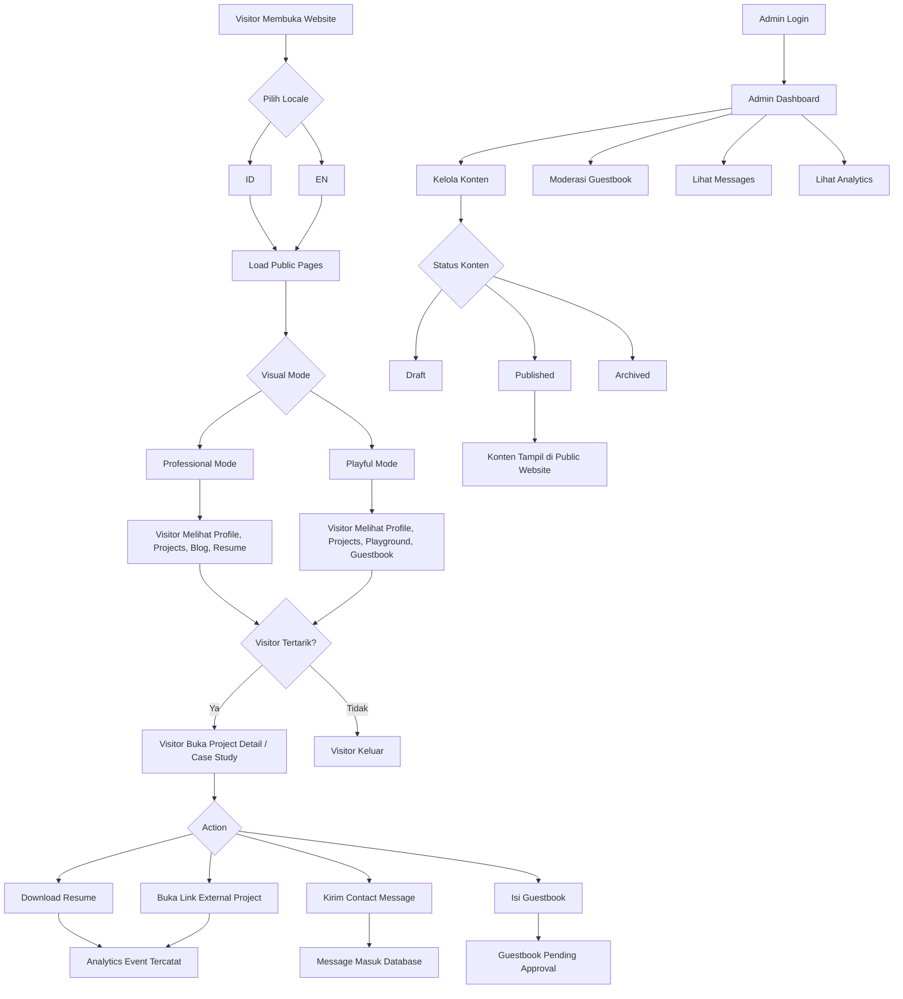
```mermaid
flowchart TD
    A[Visitor Membuka Website] --> B{Pilih Locale}
    B --> B1[ID]
    B --> B2[EN]

    B1 --> C[Load Public Pages]
    B2 --> C

    C --> D{Visual Mode}
    D --> D1[Professional Mode]
    D --> D2[Playful Mode]

    D1 --> E[Visitor Melihat Profile, Projects, Blog, Resume]
    D2 --> F[Visitor Melihat Profile, Projects, Playground, Guestbook]

    E --> G{Visitor Tertarik?}
    F --> G

    G -->|Ya| H[Visitor Buka Project Detail / Case Study]
    G -->|Tidak| I[Visitor Keluar]

    H --> J{Action}
    J --> J1[Download Resume]
    J --> J2[Kirim Contact Message]
    J --> J3[Isi Guestbook]
    J --> J4[Buka Link External Project]

    J1 --> K[Analytics Event Tercatat]
    J2 --> L[Message Masuk Database]
    J3 --> M[Guestbook Pending Approval]
    J4 --> K

    N[Admin Login] --> O[Admin Dashboard]
    O --> P[Kelola Konten]
    O --> Q[Moderasi Guestbook]
    O --> R[Lihat Messages]
    O --> S[Lihat Analytics]

    P --> T{Status Konten}
    T --> T1[Draft]
    T --> T2[Published]
    T --> T3[Archived]

    T2 --> U[Konten Tampil di Public Website]
```

---

# 4. Business Flow Detail

## 4.1 Content Publishing Flow

Alur ini digunakan saat admin membuat konten seperti project, blog, case study, atau playground item.

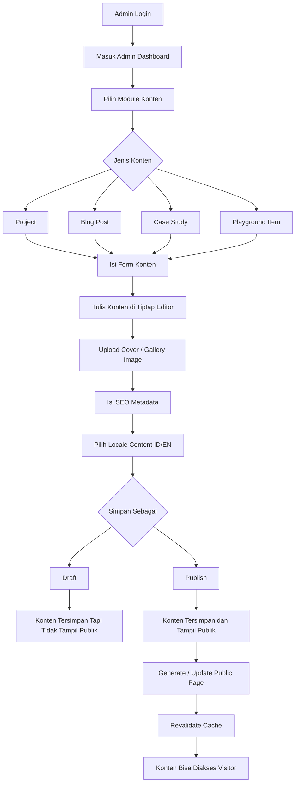
```mermaid
flowchart TD
    A[Admin Login] --> B[Masuk Admin Dashboard]
    B --> C[Pilih Module Konten]
    C --> D{Jenis Konten}
    D --> D1[Project]
    D --> D2[Blog Post]
    D --> D3[Case Study]
    D --> D4[Playground Item]

    D1 --> E[Isi Form Konten]
    D2 --> E
    D3 --> E
    D4 --> E

    E --> F[Tulis Konten di Tiptap Editor]
    F --> G[Upload Cover / Gallery Image]
    G --> H[Isi SEO Metadata]
    H --> I[Pilih Locale Content ID/EN]
    I --> J{Simpan Sebagai}
    J --> J1[Draft]
    J --> J2[Publish]

    J1 --> K[Konten Tersimpan Tapi Tidak Tampil Publik]
    J2 --> L[Konten Tersimpan dan Tampil Publik]

    L --> M[Generate / Update Public Page]
    M --> N[Revalidate Cache]
    N --> O[Konten Bisa Diakses Visitor]
```

### Penjelasan

1. Admin login.
2. Admin memilih jenis konten.
3. Admin mengisi data dasar seperti title, slug, excerpt, category, dan status.
4. Admin menulis konten menggunakan Tiptap Editor.
5. Admin mengunggah cover image atau gallery image.
6. Admin mengisi SEO metadata.
7. Admin memilih status draft atau published.
8. Jika status published, konten tampil di halaman publik.
9. Cache halaman terkait direvalidate agar data terbaru muncul.

---

## 4.2 Project Showcase Business Flow

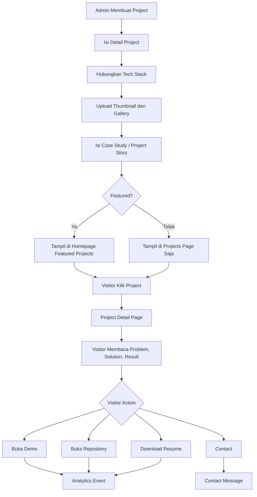
```mermaid
flowchart TD
    A[Admin Membuat Project] --> B[Isi Detail Project]
    B --> C[Hubungkan Tech Stack]
    C --> D[Upload Thumbnail dan Gallery]
    D --> E[Isi Case Study / Project Story]
    E --> F{Featured?}
    F -->|Ya| G[Tampil di Homepage Featured Projects]
    F -->|Tidak| H[Tampil di Projects Page Saja]

    G --> I[Visitor Klik Project]
    H --> I

    I --> J[Project Detail Page]
    J --> K[Visitor Membaca Problem, Solution, Result]
    K --> L{Visitor Action}
    L --> L1[Buka Demo]
    L --> L2[Buka Repository]
    L --> L3[Contact]
    L --> L4[Download Resume]

    L1 --> M[Analytics Event]
    L2 --> M
    L3 --> N[Contact Message]
    L4 --> M
```

### Penjelasan

Project bukan cuma kartu cantik. Setiap project harus menjelaskan:

- Masalah yang diselesaikan.
- Peran kamu.
- Teknologi yang dipakai.
- Keputusan teknis.
- Tantangan.
- Hasil akhir.

Ini penting karena recruiter dan founder tidak hanya melihat gambar. Mereka ingin tahu kamu berpikir atau cuma mengganti warna button sampai merasa produktif.

---

## 4.3 Contact Message Business Flow

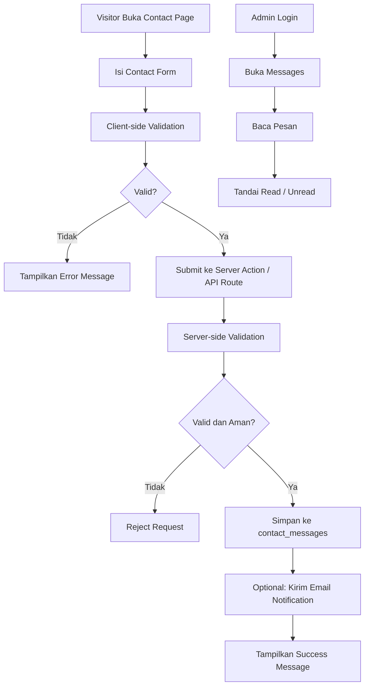
```mermaid
flowchart TD
    A[Visitor Buka Contact Page] --> B[Isi Contact Form]
    B --> C[Client-side Validation]
    C --> D{Valid?}
    D -->|Tidak| E[Tampilkan Error Message]
    D -->|Ya| F[Submit ke Server Action / API Route]

    F --> G[Server-side Validation]
    G --> H{Valid dan Aman?}
    H -->|Tidak| I[Reject Request]
    H -->|Ya| J[Simpan ke contact_messages]

    J --> K[Optional: Kirim Email Notification]
    K --> L[Tampilkan Success Message]

    M[Admin Login] --> N[Buka Messages]
    N --> O[Baca Pesan]
    O --> P[Tandai Read / Unread]
```

### Penjelasan

Form contact harus divalidasi dua kali:

1. Di client untuk UX cepat.
2. Di server untuk keamanan.

Data masuk ke tabel `contact_messages`. Admin bisa membaca pesan dari dashboard.

---

## 4.4 Guestbook Business Flow

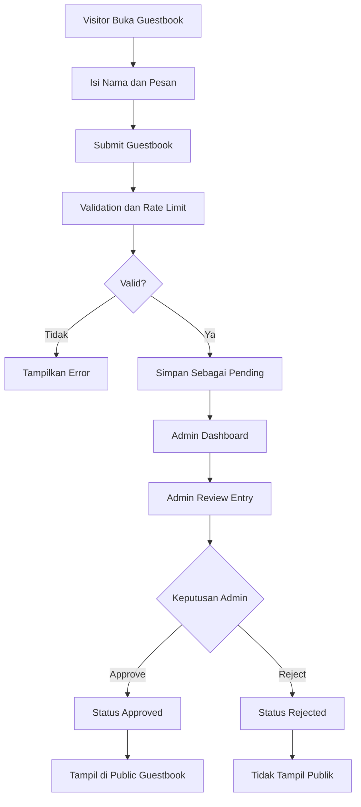
```mermaid
flowchart TD
    A[Visitor Buka Guestbook] --> B[Isi Nama dan Pesan]
    B --> C[Submit Guestbook]
    C --> D[Validation dan Rate Limit]
    D --> E{Valid?}
    E -->|Tidak| F[Tampilkan Error]
    E -->|Ya| G[Simpan Sebagai Pending]

    G --> H[Admin Dashboard]
    H --> I[Admin Review Entry]
    I --> J{Keputusan Admin}
    J -->|Approve| K[Status Approved]
    J -->|Reject| L[Status Rejected]

    K --> M[Tampil di Public Guestbook]
    L --> N[Tidak Tampil Publik]
```

### Penjelasan

Guestbook wajib dimoderasi. Jangan langsung tampil publik, karena internet adalah tempat orang menulis hal-hal yang membuat database ingin pensiun dini.

---

## 4.5 Resume Business Flow

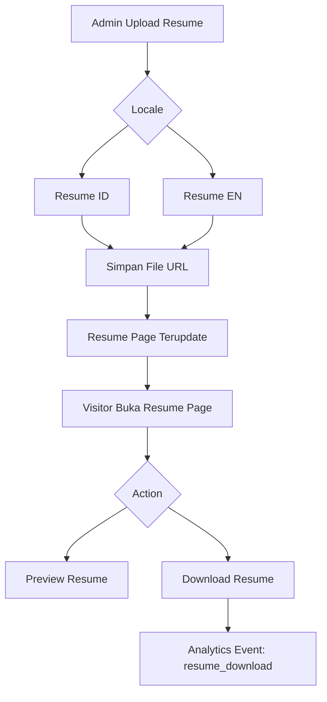
```mermaid
flowchart TD
    A[Admin Upload Resume] --> B{Locale}
    B --> B1[Resume ID]
    B --> B2[Resume EN]

    B1 --> C[Simpan File URL]
    B2 --> C

    C --> D[Resume Page Terupdate]
    D --> E[Visitor Buka Resume Page]
    E --> F{Action}
    F --> F1[Preview Resume]
    F --> F2[Download Resume]

    F2 --> G[Analytics Event: resume_download]
```

### Penjelasan

Resume dibuat bilingual:

- Resume Bahasa Indonesia.
- Resume Bahasa Inggris.

Setiap download dapat dicatat sebagai analytics event.

---

## 4.6 Analytics Business Flow

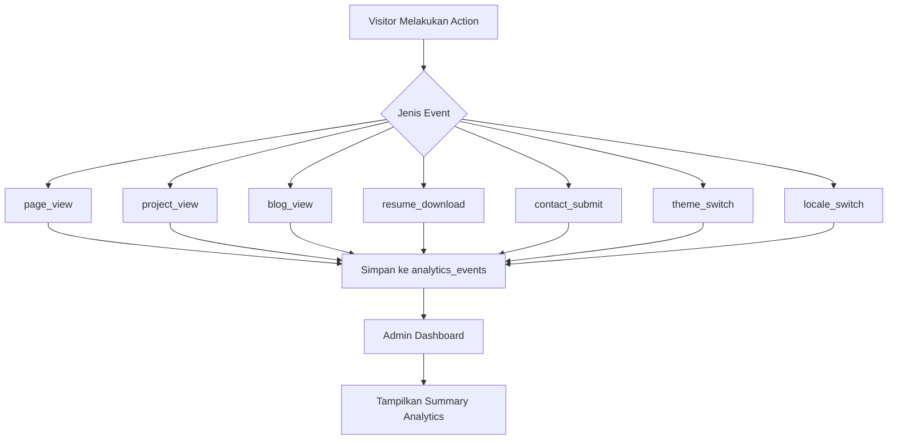
```mermaid
flowchart TD
    A[Visitor Melakukan Action] --> B{Jenis Event}
    B --> B1[page_view]
    B --> B2[project_view]
    B --> B3[blog_view]
    B --> B4[resume_download]
    B --> B5[contact_submit]
    B --> B6[theme_switch]
    B --> B7[locale_switch]

    B1 --> C[Simpan ke analytics_events]
    B2 --> C
    B3 --> C
    B4 --> C
    B5 --> C
    B6 --> C
    B7 --> C

    C --> D[Admin Dashboard]
    D --> E[Tampilkan Summary Analytics]
```

### Penjelasan

Analytics internal cukup sederhana untuk MVP. Tidak perlu membuat sistem tracking yang berlebihan. Data yang penting:

- Halaman paling sering dikunjungi.
- Project paling sering dibuka.
- Blog paling sering dibaca.
- Jumlah download resume.
- Mode visual yang sering dipakai.
- Bahasa yang paling sering dipilih.

---

# 5. User Flow

## 5.1 New Visitor Flow

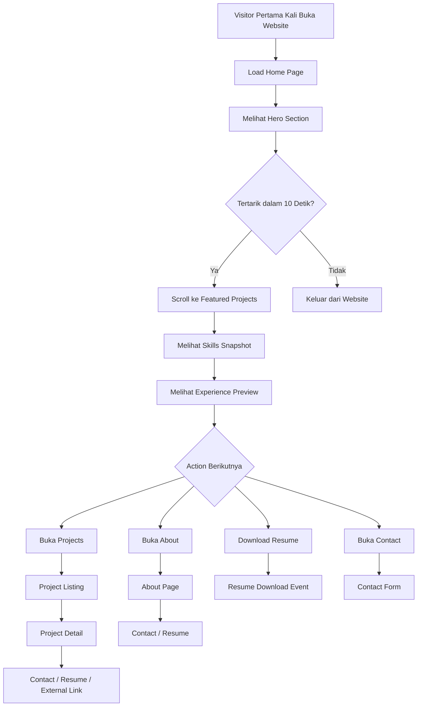
```mermaid
flowchart TD
    A[Visitor Pertama Kali Buka Website] --> B[Load Home Page]
    B --> C[Melihat Hero Section]
    C --> D{Tertarik dalam 10 Detik?}

    D -->|Ya| E[Scroll ke Featured Projects]
    D -->|Tidak| F[Keluar dari Website]

    E --> G[Melihat Skills Snapshot]
    G --> H[Melihat Experience Preview]
    H --> I{Action Berikutnya}

    I --> I1[Buka Projects]
    I --> I2[Buka About]
    I --> I3[Download Resume]
    I --> I4[Buka Contact]

    I1 --> J[Project Listing]
    J --> K[Project Detail]
    K --> L[Contact / Resume / External Link]

    I2 --> M[About Page]
    M --> N[Contact / Resume]

    I3 --> O[Resume Download Event]
    I4 --> P[Contact Form]
```

### Penjelasan

Visitor baru harus bisa memahami tiga hal dengan cepat:

1. Siapa kamu.
2. Kamu bisa apa.
3. Bukti kamu bisa melakukan itu.

Jika tiga hal ini tidak terlihat cepat, maka website gagal secara UX meskipun animasinya bisa menari salsa.

---

## 5.2 Recruiter Flow

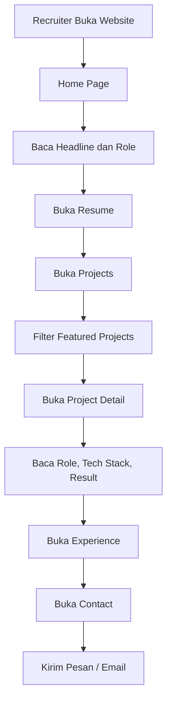
```mermaid
flowchart TD
    A[Recruiter Buka Website] --> B[Home Page]
    B --> C[Baca Headline dan Role]
    C --> D[Buka Resume]
    D --> E[Buka Projects]
    E --> F[Filter Featured Projects]
    F --> G[Buka Project Detail]
    G --> H[Baca Role, Tech Stack, Result]
    H --> I[Buka Experience]
    I --> J[Buka Contact]
    J --> K[Kirim Pesan / Email]
```

### Penjelasan

Recruiter biasanya butuh cepat. Prioritas recruiter:

- Role jelas.
- Resume mudah ditemukan.
- Project terbaik tampil.
- Contact mudah.

Maka tombol Resume dan Contact harus muncul di area strategis:

- Navbar.
- Hero.
- Project detail.
- Footer.

---

## 5.3 Startup Founder Flow

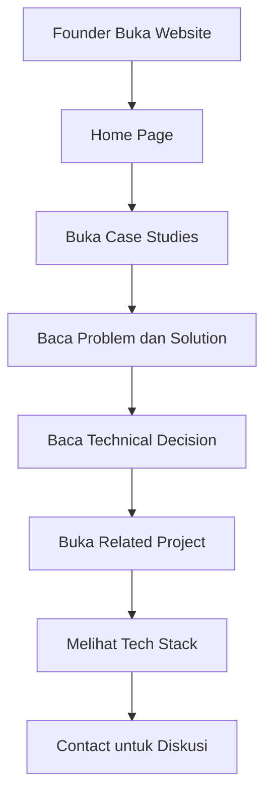
```mermaid
flowchart TD
    A[Founder Buka Website] --> B[Home Page]
    B --> C[Buka Case Studies]
    C --> D[Baca Problem dan Solution]
    D --> E[Baca Technical Decision]
    E --> F[Buka Related Project]
    F --> G[Melihat Tech Stack]
    G --> H[Contact untuk Diskusi]
```

### Penjelasan

Founder lebih peduli ke kemampuan menyelesaikan masalah. Jadi case study harus kuat.

Case study harus menjawab:

- Masalah apa yang diselesaikan?
- Kenapa pakai pendekatan itu?
- Apa dampaknya?
- Apa keputusan teknis yang penting?

---

## 5.4 Freelance Client Flow

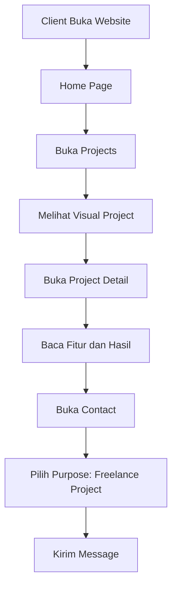
```mermaid
flowchart TD
    A[Client Buka Website] --> B[Home Page]
    B --> C[Buka Projects]
    C --> D[Melihat Visual Project]
    D --> E[Buka Project Detail]
    E --> F[Baca Fitur dan Hasil]
    F --> G[Buka Contact]
    G --> H[Pilih Purpose: Freelance Project]
    H --> I[Kirim Message]
```

### Penjelasan

Client freelance biasanya lebih visual. Mereka ingin melihat hasil akhir dan merasa yakin kamu bisa membuat sesuatu yang rapi. Project thumbnail dan case study visual sangat penting.

---

## 5.5 Developer Visitor Flow

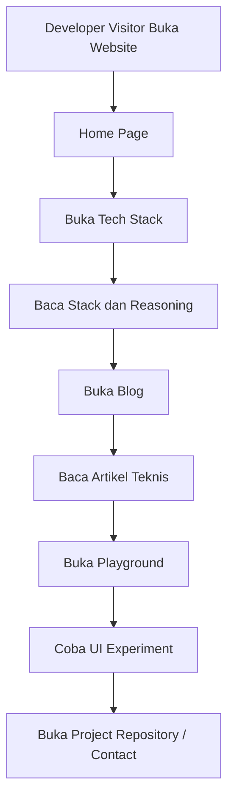
```mermaid
flowchart TD
    A[Developer Visitor Buka Website] --> B[Home Page]
    B --> C[Buka Tech Stack]
    C --> D[Baca Stack dan Reasoning]
    D --> E[Buka Blog]
    E --> F[Baca Artikel Teknis]
    F --> G[Buka Playground]
    G --> H[Coba UI Experiment]
    H --> I[Buka Project Repository / Contact]
```

### Penjelasan

Developer visitor biasanya tertarik ke:

- Stack.
- Architecture.
- Blog teknis.
- Playground.
- Repository.

Playground hanya muncul dalam Playful Mode agar professional mode tetap bersih.

---

## 5.6 Admin Login Flow

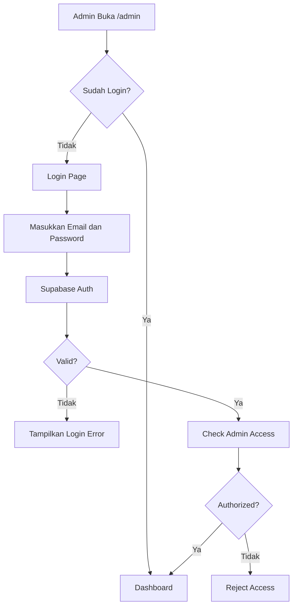
```mermaid
flowchart TD
    A[Admin Buka /admin] --> B{Sudah Login?}
    B -->|Ya| C[Dashboard]
    B -->|Tidak| D[Login Page]

    D --> E[Masukkan Email dan Password]
    E --> F[Supabase Auth]
    F --> G{Valid?}
    G -->|Tidak| H[Tampilkan Login Error]
    G -->|Ya| I[Check Admin Access]
    I --> J{Authorized?}
    J -->|Tidak| K[Reject Access]
    J -->|Ya| C
```

### Penjelasan

Walaupun hanya satu admin, tetap perlu validasi authorization. Jangan sekadar login lalu semua user bisa masuk admin. Itu bukan CMS, itu undangan bencana.

---

## 5.7 Admin Create Project Flow

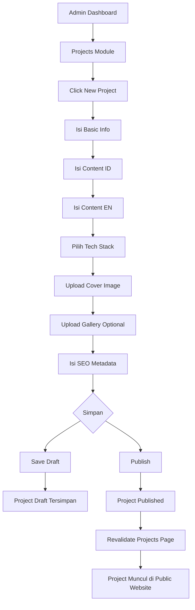
```mermaid
flowchart TD
    A[Admin Dashboard] --> B[Projects Module]
    B --> C[Click New Project]
    C --> D[Isi Basic Info]
    D --> E[Isi Content ID]
    E --> F[Isi Content EN]
    F --> G[Pilih Tech Stack]
    G --> H[Upload Cover Image]
    H --> I[Upload Gallery Optional]
    I --> J[Isi SEO Metadata]
    J --> K{Simpan}
    K --> K1[Save Draft]
    K --> K2[Publish]

    K1 --> L[Project Draft Tersimpan]
    K2 --> M[Project Published]
    M --> N[Revalidate Projects Page]
    N --> O[Project Muncul di Public Website]
```

---

## 5.8 Admin Edit Blog Flow

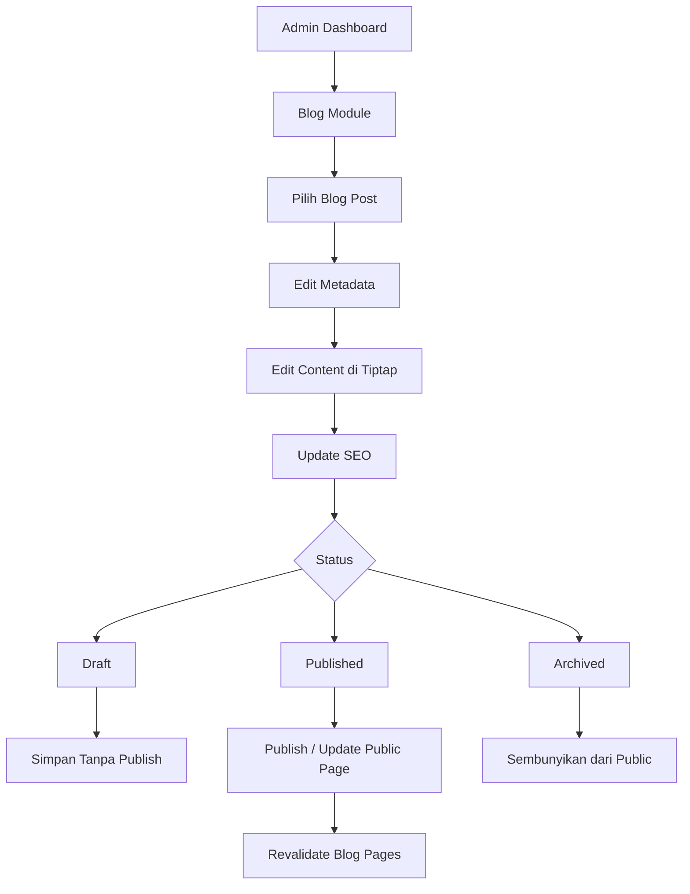
```mermaid
flowchart TD
    A[Admin Dashboard] --> B[Blog Module]
    B --> C[Pilih Blog Post]
    C --> D[Edit Metadata]
    D --> E[Edit Content di Tiptap]
    E --> F[Update SEO]
    F --> G{Status}
    G --> G1[Draft]
    G --> G2[Published]
    G --> G3[Archived]

    G1 --> H[Simpan Tanpa Publish]
    G2 --> I[Publish / Update Public Page]
    G3 --> J[Sembunyikan dari Public]

    I --> K[Revalidate Blog Pages]
```

---

# 6. Visual Mode Flow

## 6.1 Theme Mode Flow

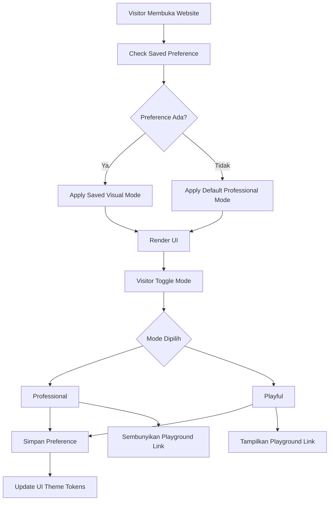
```mermaid
flowchart TD
    A[Visitor Membuka Website] --> B[Check Saved Preference]
    B --> C{Preference Ada?}
    C -->|Ya| D[Apply Saved Visual Mode]
    C -->|Tidak| E[Apply Default Professional Mode]

    D --> F[Render UI]
    E --> F

    F --> G[Visitor Toggle Mode]
    G --> H{Mode Dipilih}
    H --> H1[Professional]
    H --> H2[Playful]

    H1 --> I[Simpan Preference]
    H2 --> I
    I --> J[Update UI Theme Tokens]

    H2 --> K[Tampilkan Playground Link]
    H1 --> L[Sembunyikan Playground Link]
```

### Penjelasan

Default mode adalah Professional. Ini penting karena target utama website tetap karier dan kerja.

Playful mode aktif jika user memilihnya. Saat playful mode aktif:

- Link Playground muncul.
- Interaksi visual lebih hidup.
- Card dan layout berubah sesuai token playful.

---

# 7. Locale Flow

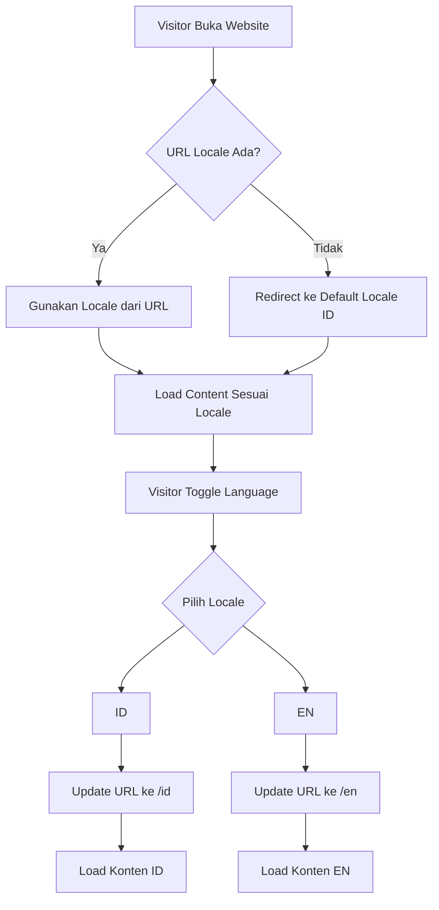
```mermaid
flowchart TD
    A[Visitor Buka Website] --> B{URL Locale Ada?}
    B -->|Ya| C[Gunakan Locale dari URL]
    B -->|Tidak| D[Redirect ke Default Locale ID]

    C --> E[Load Content Sesuai Locale]
    D --> E

    E --> F[Visitor Toggle Language]
    F --> G{Pilih Locale}
    G --> G1[ID]
    G --> G2[EN]

    G1 --> H[Update URL ke /id]
    G2 --> I[Update URL ke /en]

    H --> J[Load Konten ID]
    I --> K[Load Konten EN]
```

### Penjelasan

Struktur route:

```txt
/id
/en
/id/projects
/en/projects
/id/blog/[slug]
/en/blog/[slug]
```

Locale sebaiknya ada di URL agar SEO lebih kuat.

---

# 8. Search & Filter Flow

## 8.1 Project Filter Flow

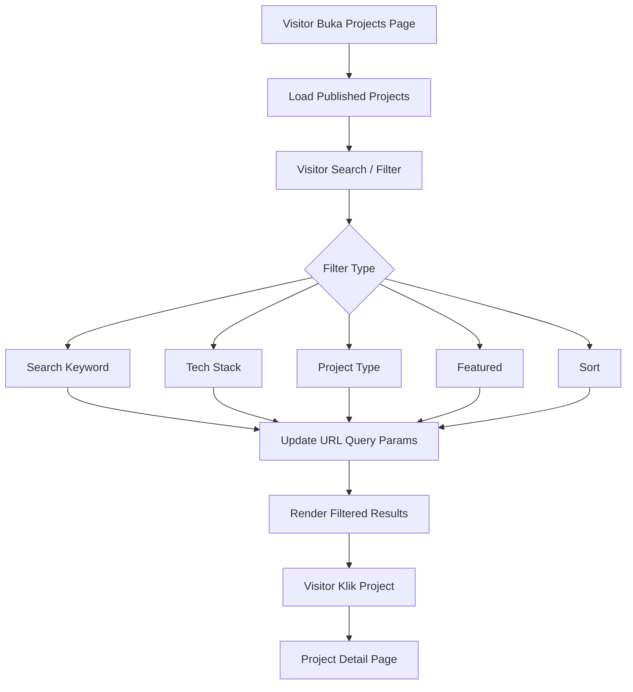
```mermaid
flowchart TD
    A[Visitor Buka Projects Page] --> B[Load Published Projects]
    B --> C[Visitor Search / Filter]
    C --> D{Filter Type}
    D --> D1[Search Keyword]
    D --> D2[Tech Stack]
    D --> D3[Project Type]
    D --> D4[Featured]
    D --> D5[Sort]

    D1 --> E[Update URL Query Params]
    D2 --> E
    D3 --> E
    D4 --> E
    D5 --> E

    E --> F[Render Filtered Results]
    F --> G[Visitor Klik Project]
    G --> H[Project Detail Page]
```

### Penjelasan

Filter bisa dilakukan client-side jika data project masih sedikit. Jika data besar, gunakan server-side filtering via URL query.

Disarankan pakai URL query agar state bisa dibagikan:

```txt
/id/projects?tech=nextjs&type=dashboard&sort=featured
```

---

# 9. Error Flow

## 9.1 Public Error Flow

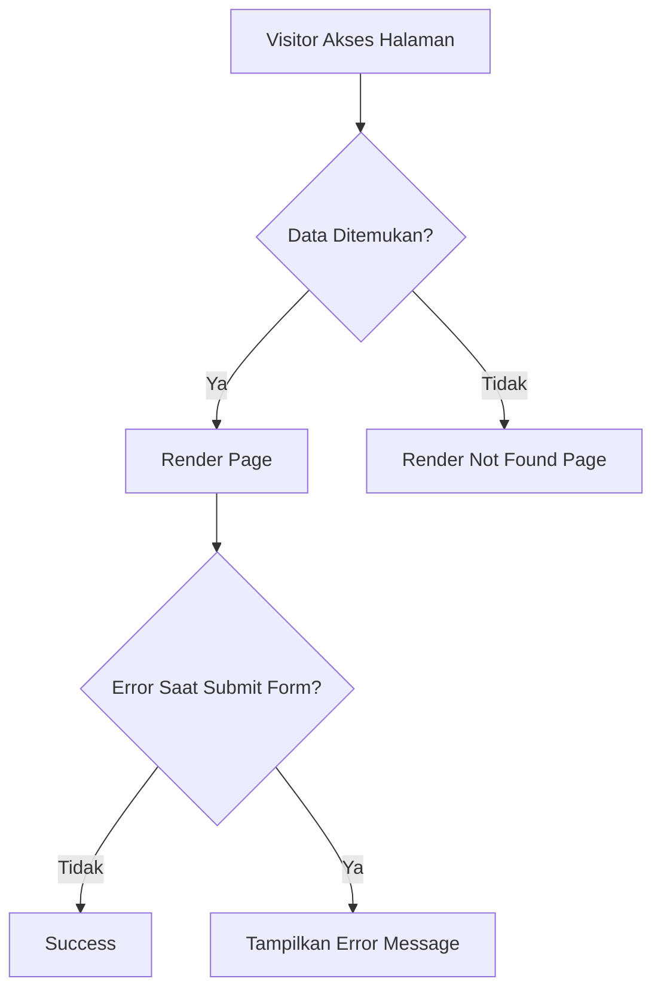
```mermaid
flowchart TD
    A[Visitor Akses Halaman] --> B{Data Ditemukan?}
    B -->|Ya| C[Render Page]
    B -->|Tidak| D[Render Not Found Page]

    C --> E{Error Saat Submit Form?}
    E -->|Tidak| F[Success]
    E -->|Ya| G[Tampilkan Error Message]
```

## 9.2 Admin Error Flow

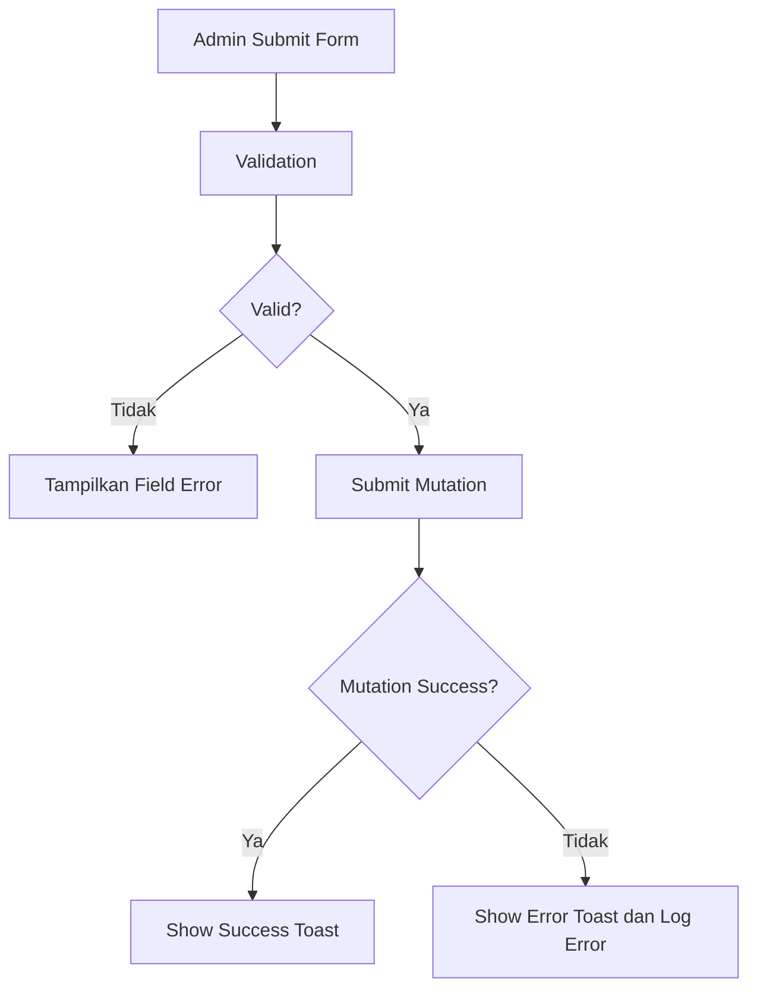
```mermaid
flowchart TD
    A[Admin Submit Form] --> B[Validation]
    B --> C{Valid?}
    C -->|Tidak| D[Tampilkan Field Error]
    C -->|Ya| E[Submit Mutation]

    E --> F{Mutation Success?}
    F -->|Ya| G[Show Success Toast]
    F -->|Tidak| H[Show Error Toast dan Log Error]
```

---

# 10. Page-Level Flow Summary

## 10.1 Public Pages

| Page | Primary Goal | Main Action |
|---|---|---|
| Home | First impression | View project / contact / resume |
| About | Explain identity | Contact / resume |
| Skills | Show capability | Explore related projects |
| Experience | Show credibility | View project / resume |
| Projects | Show work | Open project detail |
| Project Detail | Explain project deeply | Demo / repo / contact |
| Case Studies | Explain problem solving | Contact |
| Blog | SEO and technical writing | Read post |
| Playground | Show creativity | Try experiment |
| Tech Stack | Show tools and reasoning | Related project |
| Coding Stats | Show curated activity | Explore work |
| Contact | Convert visitor | Send message |
| Resume | Provide CV | Download resume |
| Guestbook | Social proof | Submit message |

---

## 10.2 Admin Pages

| Page | Primary Goal | Main Action |
|---|---|---|
| Dashboard | Overview | Navigate modules |
| Profile | Edit identity | Update profile |
| Projects | Manage projects | CRUD project |
| Blog | Manage articles | CRUD post |
| Case Studies | Manage case studies | CRUD case study |
| Skills | Manage skills | CRUD skill |
| Experience | Manage experience | CRUD experience |
| Tech Stack | Manage tools | CRUD technology |
| Playground | Manage experiments | CRUD playground |
| Resume | Manage resume files | Upload CV |
| Messages | Read contact messages | Mark read |
| Guestbook | Moderate entries | Approve/reject |
| Analytics | See performance | Analyze events |
| Settings | Configure site | Update settings |

---

# 11. Performance Flow

## 11.1 Public Page Loading Flow

```mermaid
flowchart TD
    A[Request Public Page] --> B[Next.js Server]
    B --> C[Fetch Published Data]
    C --> D[Apply Locale]
    D --> E[Generate Metadata]
    E --> F[Render Server Component]
    F --> G[Send HTML to Browser]
    G --> H[Hydrate Minimal Client Components]
    H --> I[Lazy Load Non-Critical Interactions]
```

### Penjelasan

Public page harus memuat HTML utama dari server. Client-side JavaScript hanya untuk komponen yang benar-benar interaktif.

---

## 11.2 Admin Page Loading Flow

```mermaid
flowchart TD
    A[Request Admin Page] --> B[Auth Middleware]
    B --> C{Authorized?}
    C -->|Tidak| D[Redirect Login]
    C -->|Ya| E[Load Admin Layout]
    E --> F[Load Admin Data]
    F --> G[Hydrate Admin Client Components]
    G --> H[Enable CRUD Interaction]
```

### Penjelasan

Admin boleh lebih client-heavy karena hanya dipakai pemilik website. Yang penting bundle admin tidak bocor ke public pages.

---

# 12. Recommended MVP Flow

```mermaid
flowchart TD
    A[Phase 1] --> B[Professional Mode]
    B --> C[Core Public Pages]
    C --> D[Admin CRUD Basic]
    D --> E[Projects dan Resume Ready]

    E --> F[Phase 2]
    F --> G[Blog dan Case Study]
    G --> H[SEO Serious]
    H --> I[ID + EN Content]

    I --> J[Phase 3]
    J --> K[Playful Mode]
    K --> L[Playground]
    L --> M[Guestbook]

    M --> N[Phase 4]
    N --> O[Analytics]
    O --> P[Performance Audit]
    P --> Q[Accessibility Audit]
```

---

# 13. Final Flow Principle

Website ini harus mengikuti prinsip:

```txt
Content first.
Performance second.
Interaction third.
Decoration last.
```

Karena portfolio yang baik bukan yang paling banyak animasinya, tapi yang paling cepat menjelaskan kemampuan kamu dan membuat pengunjung percaya.

Animasi itu bumbu. Kalau isi project kosong, animasi hanya membuat kekosongan terlihat lebih mahal.
