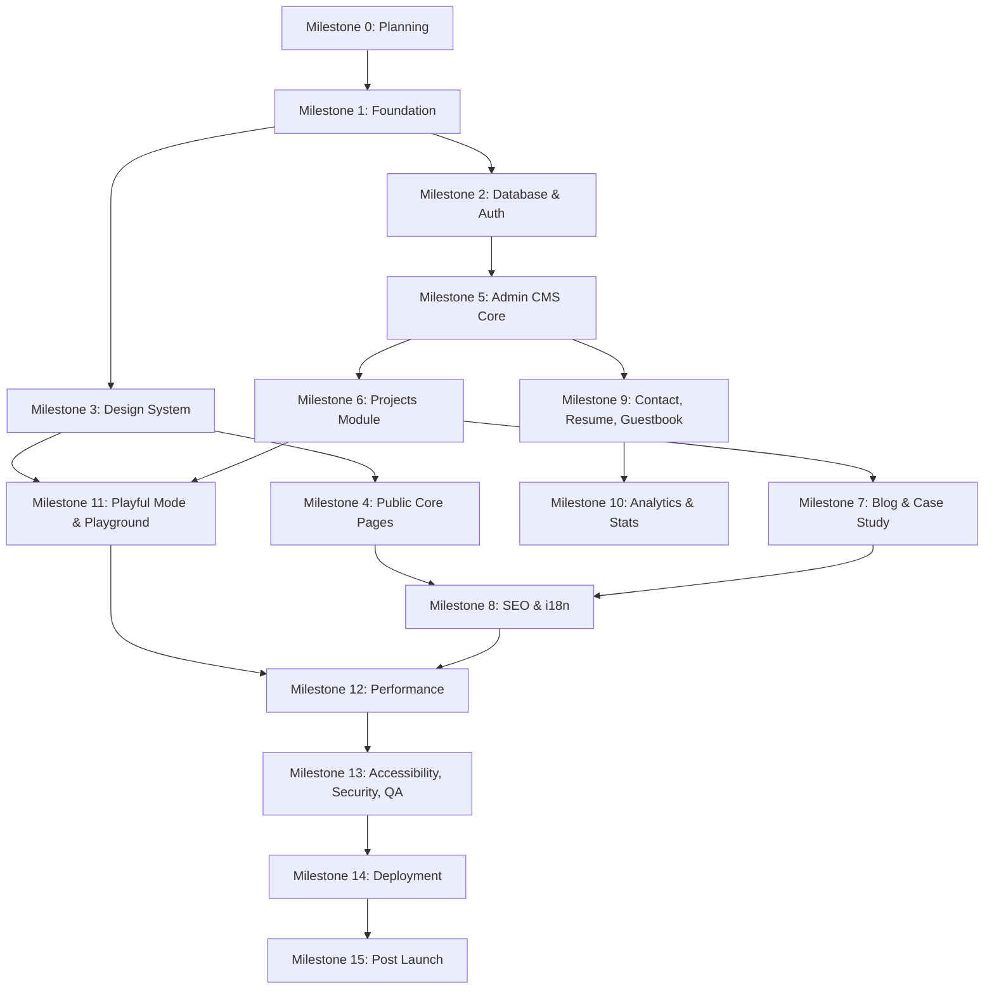

# milestone.md

# Portfolio Dynamic Website - Milestone & Task Breakdown

Dokumen ini berisi pecahan milestone dan task berdasarkan PRD portfolio dinamis yang sudah dibuat.

Tujuan dokumen ini:

- Membuat proses development lebih terarah.
- Menghindari scope melebar tanpa kontrol.
- Memecah pekerjaan besar menjadi task kecil.
- Menentukan prioritas pengerjaan.
- Memberi acceptance criteria agar setiap milestone jelas selesai atau belum.
- Menjaga website tetap ringan, SEO-friendly, dan tidak berubah menjadi taman bermain JavaScript yang kebetulan punya halaman About.

---

# 1. Project Overview

Website yang akan dibuat adalah portfolio dinamis untuk kebutuhan kerja sebagai **Frontend Engineer**.

Stack utama:

```txt
Next.js App Router
TypeScript
Tailwind CSS
shadcn/ui
Framer Motion
Supabase
PostgreSQL
Drizzle ORM
TanStack Query
Tiptap Editor
next-intl
Zod
React Hook Form
```

Mode desain:

```txt
1. Modern Simple Professional
2. Playful Modern
```

Strategi utama:

```txt
- Multi-page website, bukan SPA penuh.
- Professional mode sebagai default.
- Playful mode sebagai alternate experience.
- Playground hanya tersedia di Playful Mode.
- Public pages harus cepat dan SEO-friendly.
- Admin CMS bisa lebih interaktif, tapi tidak boleh membebani public bundle.
```

---

# 2. Milestone Summary

```txt
Milestone 0  - Project Planning & Setup
Milestone 1  - Foundation: App, Theme, Layout, Routing
Milestone 2  - Database, Supabase, Drizzle, Auth
Milestone 3  - Design System & UI Components
Milestone 4  - Public Core Pages: Professional Mode
Milestone 5  - Admin CMS Core
Milestone 6  - Projects Module
Milestone 7  - Blog & Case Study Module
Milestone 8  - SEO, i18n, Metadata, Sitemap
Milestone 9  - Contact, Resume, Guestbook
Milestone 10 - Analytics & Coding Stats
Milestone 11 - Playful Mode & Playground
Milestone 12 - Performance Optimization
Milestone 13 - Accessibility, Security, QA
Milestone 14 - Deployment & Production Readiness
Milestone 15 - Post-Launch Iteration
```

---

# 3. Development Principle

Gunakan urutan ini:

```txt
Data structure first.
Design system second.
Core public pages third.
Admin CMS fourth.
Advanced interaction last.
```

Jangan mulai dari animasi. Animasi itu topping, bukan nasi. Portfolio tanpa konten yang jelas cuma kue ulang tahun dari CSS.

---

# 4. Milestone 0 - Project Planning & Setup

## Goal

Menyiapkan arah project, struktur kerja, dan konfigurasi awal supaya development tidak liar.

## Tasks

### 0.1 Finalisasi requirement utama

- [ ] Pastikan target utama: Frontend Engineer.
- [ ] Pastikan target audience: recruiter, startup founder, client freelance.
- [ ] Pastikan website multi-page, bukan SPA penuh.
- [ ] Pastikan mode default: Professional.
- [ ] Pastikan Playful Mode sebagai alternate mode.
- [ ] Pastikan Playground hanya untuk Playful Mode.
- [ ] Pastikan bilingual: ID + EN.
- [ ] Pastikan admin hanya satu role.

## Output

```txt
- PRD final.
- flow.md final.
- erd.md final.
- milestone.md final.
```

## Acceptance Criteria

- [ ] Semua kebutuhan utama sudah terdokumentasi.
- [ ] Scope MVP jelas.
- [ ] Fitur yang bukan prioritas sudah ditunda ke milestone lanjutan.
- [ ] Tidak ada fitur besar yang belum punya tempat di milestone.

---

# 5. Milestone 1 - Foundation: App, Theme, Layout, Routing

## Goal

Membuat pondasi aplikasi Next.js yang rapi, scalable, dan siap untuk multi-page, i18n, serta theme mode.

## Tasks

### 1.1 Inisialisasi project

- [x] Buat project Next.js App Router.
- [x] Aktifkan TypeScript.
- [x] Setup ESLint.
- [x] Setup Prettier.
- [x] Setup Tailwind CSS.
- [x] Setup path alias.
- [x] Setup struktur folder dasar.

Suggested folder:

```txt
src/
├─ app/
├─ components/
├─ features/
├─ lib/
├─ styles/
├─ config/
└─ server/
```

---

### 1.2 Setup route groups

- [x] Buat route group public site.
- [x] Buat route group admin.
- [x] Buat route locale `[locale]`.
- [x] Buat root layout.
- [x] Buat public layout.
- [x] Buat admin layout.

Target structure:

```txt
src/app/
├─ [locale]/
│  ├─ (site)/
│  └─ layout.tsx
├─ admin/
├─ api/
├─ sitemap.ts
├─ robots.ts
└─ layout.tsx
```

---

### 1.3 Setup i18n routing dasar

- [x] Install dan setup `next-intl`.
- [x] Definisikan locale: `id`, `en`.
- [x] Set default locale: `id`.
- [x] Buat middleware locale.
- [x] Buat helper untuk switch locale.
- [x] Buat sample translation file.

---

### 1.4 Setup visual mode foundation

Visual mode:

```txt
professional
playful
```

Color scheme:

```txt
light
dark
system
```

Tasks:

- [x] Buat theme provider.
- [x] Buat visual mode provider.
- [x] Simpan preference ke local storage/cookie.
- [x] Set default visual mode ke `professional`.
- [x] Buat attribute di root element:

```txt
data-visual-mode="professional"
data-theme="light"
```

---

### 1.5 Setup base layout

- [x] Buat site shell.
- [x] Buat navbar dasar.
- [x] Buat footer dasar.
- [x] Buat mobile nav dasar.
- [x] Tambahkan theme switcher placeholder.
- [x] Tambahkan locale switcher placeholder.

## Output

```txt
- App Next.js siap.
- Routing public/admin tersedia.
- Locale routing tersedia.
- Theme foundation tersedia.
- Layout dasar tersedia.
```

## Acceptance Criteria

- [x] `/id` bisa dibuka.
- [x] `/en` bisa dibuka.
- [x] `/admin` memiliki layout sendiri.
- [x] Visual mode bisa berubah secara teknis.
- [x] Locale bisa berubah secara teknis.
- [x] Tidak ada public page yang bergantung pada SPA routing.

---

# 6. Milestone 2 - Database, Supabase, Drizzle, Auth

## Goal

Menyiapkan backend data layer, schema database, migration, Supabase Auth, dan aturan akses awal.

## Tasks

### 2.1 Setup Supabase project

- [x] Buat project Supabase.
- [x] Setup environment variables.
- [x] Setup Supabase client untuk server.
- [x] Setup Supabase client untuk browser jika diperlukan.
- [x] Setup Supabase Storage bucket awal.

Buckets:

```txt
avatars
projects
blogs
case-studies
playground
resumes
general
```

---

### 2.2 Setup Drizzle ORM

- [x] Install Drizzle.
- [x] Setup database connection.
- [x] Setup drizzle config.
- [x] Setup migration command.
- [x] Setup schema folder modular.

Suggested schema folder:

```txt
src/lib/db/schema/
├─ profile.ts
├─ resume.ts
├─ project.ts
├─ technology.ts
├─ skill.ts
├─ experience.ts
├─ post.ts
├─ case-study.ts
├─ playground.ts
├─ contact.ts
├─ guestbook.ts
├─ analytics.ts
└─ index.ts
```

---

### 2.3 Implement core schemas

- [x] `profiles`
- [x] `resumes`
- [x] `projects`
- [x] `project_images`
- [x] `technologies`
- [x] `project_technologies`
- [x] `skills`
- [x] `experiences`
- [x] `experience_technologies`
- [x] `post_categories`
- [x] `posts`
- [x] `case_studies`
- [x] `case_study_images`
- [x] `case_study_technologies`
- [x] `playground_items`
- [x] `playground_technologies`
- [x] `contact_messages`
- [x] `guestbook_statuses`
- [x] `guestbook_entries`
- [x] `analytics_sessions`
- [x] `analytics_events`

---

### 2.4 Add indexes

- [x] Index slug untuk projects.
- [x] Index status untuk projects.
- [x] Index featured untuk projects.
- [x] Index slug untuk posts.
- [x] Index status untuk posts.
- [x] Index slug untuk case studies.
- [x] Index status untuk case studies.
- [x] Index slug untuk technologies.
- [x] Index featured untuk skills.
- [x] Index created_at untuk contact messages.
- [x] Index status untuk guestbook.
- [x] Index event_name, path, created_at untuk analytics.

---

### 2.5 Setup Supabase Auth

- [x] Aktifkan email/password login.
- [x] Buat admin user.
- [x] Buat admin authorization helper.
- [x] Buat middleware untuk protect `/admin`.
- [x] Buat login page.
- [x] Buat logout action.

---

### 2.6 Setup RLS policy

Public read:

- [x] Published projects only.
- [x] Published posts only.
- [x] Published case studies only.
- [x] Published playground items only.
- [x] Approved guestbook entries only.

Admin access:

- [x] Admin can insert/update/delete content.
- [x] Admin can read contact messages.
- [x] Admin can moderate guestbook.
- [x] Admin can manage uploads.

## Output

```txt
- Database schema siap.
- Migration berjalan.
- Supabase Auth aktif.
- Admin protection aktif.
- RLS dasar aktif.
```

## Acceptance Criteria

- [x] Database bisa dimigrate tanpa error.
- [x] Admin bisa login.
- [x] Non-admin tidak bisa masuk `/admin`.
- [x] Public hanya bisa membaca konten published/approved.
- [x] Service role key tidak pernah muncul di client bundle.

Catatan implementasi:

- Migration sudah dijalankan lewat `bun run db:migrate`.
- Admin Auth user dibuat/diaktifkan dari Supabase Auth, lalu dihubungkan ke `public.admin_users` lewat `supabase/admin-setup.sql`.
- Login membutuhkan `NEXT_PUBLIC_SUPABASE_URL` dan `NEXT_PUBLIC_SUPABASE_ANON_KEY` di environment runtime.

---

# 7. Milestone 3 - Design System & UI Components

## Goal

Membangun fondasi visual berdasarkan design system dua mode.

## Tasks

### 3.1 Setup design tokens

- [ ] Buat `tokens.css`.
- [ ] Buat `themes.css`.
- [ ] Tambahkan token professional light.
- [ ] Tambahkan token professional dark.
- [ ] Tambahkan token playful light.
- [ ] Tambahkan token playful dark.
- [ ] Mapping token ke Tailwind config.
- [ ] Mapping token ke shadcn variables.

---

### 3.2 Setup typography

Professional:

```txt
Geist Sans
Geist Mono
```

Playful:

```txt
Plus Jakarta Sans
Space Grotesk
JetBrains Mono
```

Tasks:

- [ ] Setup font dengan `next/font`.
- [ ] Batasi font weight agar bundle tidak bengkak.
- [ ] Buat typography scale.
- [ ] Buat prose style untuk rich text.
- [ ] Buat heading style per mode.

---

### 3.3 Setup shadcn/ui

- [ ] Init shadcn.
- [ ] Install komponen dasar:
  - [ ] Button
  - [ ] Card
  - [ ] Input
  - [ ] Textarea
  - [ ] Select
  - [ ] Dialog
  - [ ] Dropdown Menu
  - [ ] Tabs
  - [ ] Badge
  - [ ] Separator
  - [ ] Sheet
  - [ ] Tooltip
  - [ ] Toast/Sonner
  - [ ] Form

---

### 3.4 Build custom shared components

- [ ] SiteHeader.
- [ ] SiteFooter.
- [ ] MobileNav.
- [ ] ThemeSwitcher.
- [ ] LocaleSwitcher.
- [ ] SectionHeader.
- [ ] Container.
- [ ] PageHeader.
- [ ] EmptyState.
- [ ] LoadingState.
- [ ] ErrorState.
- [ ] RichTextRenderer.
- [ ] SEOJsonLd component.
- [ ] ExternalLink.
- [ ] CopyButton.

---

### 3.5 Build portfolio-specific components

- [ ] HeroSection.
- [ ] AboutPreview.
- [ ] FeaturedProjects.
- [ ] ProjectCard.
- [ ] ProjectDetailHero.
- [ ] TechBadge.
- [ ] SkillCard.
- [ ] ExperienceTimeline.
- [ ] BlogCard.
- [ ] CaseStudyCard.
- [ ] StatCard.
- [ ] ContactCTA.
- [ ] ResumeCTA.
- [ ] GuestbookCard.
- [ ] PlaygroundCard.

---

### 3.6 Component variants by mode

- [ ] Button professional variant.
- [ ] Button playful variant.
- [ ] Card professional variant.
- [ ] Card playful variant.
- [ ] Navbar professional variant.
- [ ] Navbar playful variant.
- [ ] Project card professional variant.
- [ ] Project card playful variant.

## Output

```txt
- Design token aktif.
- Komponen UI dasar siap.
- Komponen portfolio utama siap.
- Visual mode memengaruhi styling.
```

## Acceptance Criteria

- [ ] Komponen bisa dipakai di professional dan playful mode.
- [ ] Tidak ada warna hardcoded yang tidak perlu.
- [ ] Token dipakai konsisten.
- [ ] Font tampil benar.
- [ ] Komponen tetap accessible secara dasar.

---

# 8. Milestone 4 - Public Core Pages: Professional Mode

## Goal

Membangun halaman publik inti dengan Professional Mode sebagai default.

## Tasks

### 4.1 Home Page

Sections:

- [ ] Hero.
- [ ] Short About.
- [ ] Featured Projects.
- [ ] Skills Snapshot.
- [ ] Experience Preview.
- [ ] Coding Stats Preview.
- [ ] Blog Preview.
- [ ] Contact CTA.

Data:

- [ ] Fetch profile.
- [ ] Fetch featured projects.
- [ ] Fetch featured skills.
- [ ] Fetch latest posts.
- [ ] Fetch experience preview.
- [ ] Fetch stats summary.

---

### 4.2 About Page

- [ ] Bio lengkap.
- [ ] Avatar/profile image.
- [ ] Developer identity.
- [ ] Work principles.
- [ ] Technical interest.
- [ ] CTA ke contact dan resume.

---

### 4.3 Skills Page

- [ ] Skill list.
- [ ] Category grouping.
- [ ] Search skill.
- [ ] Filter category.
- [ ] Skill level display.
- [ ] Related tech display.

---

### 4.4 Experience Page

- [ ] Timeline.
- [ ] Experience detail.
- [ ] Employment type badge.
- [ ] Date range.
- [ ] Tech used.
- [ ] Empty state.

---

### 4.5 Tech Stack Page

- [ ] Stack group.
- [ ] Tool description.
- [ ] Reason why used.
- [ ] Related project.
- [ ] Category filter.

---

### 4.6 Coding Stats Page

- [ ] Curated stats display.
- [ ] Projects shipped.
- [ ] Articles written.
- [ ] UI experiments count.
- [ ] Technologies used count.
- [ ] Case studies count.

---

### 4.7 Resume Page

- [ ] Resume preview area.
- [ ] Resume download button.
- [ ] Locale-based resume.
- [ ] Last updated info.
- [ ] Track download event placeholder.

---

### 4.8 Contact Page

- [ ] Contact form UI.
- [ ] Contact info.
- [ ] Social links.
- [ ] Availability status.
- [ ] Purpose selector.

## Output

```txt
- Core public pages professional mode selesai.
- Semua halaman bisa diakses via /id dan /en.
- Layout clean, minimal, premium.
```

## Acceptance Criteria

- [ ] Home page menjelaskan identity dalam 10 detik.
- [ ] Resume dan contact mudah ditemukan.
- [ ] Semua core pages render dari server sebisa mungkin.
- [ ] Tidak ada admin/editor bundle di public pages.
- [ ] Professional mode terasa clean dan premium.

---

# 9. Milestone 5 - Admin CMS Core

## Goal

Membuat dashboard admin sebagai pusat pengelolaan konten.

## Tasks

### 5.1 Admin layout

- [ ] Sidebar.
- [ ] Topbar.
- [ ] Breadcrumb.
- [ ] User/admin menu.
- [ ] Logout button.
- [ ] Responsive admin layout.

---

### 5.2 Admin dashboard

Cards:

- [ ] Total projects.
- [ ] Total posts.
- [ ] Total case studies.
- [ ] Draft count.
- [ ] Contact messages count.
- [ ] Guestbook pending count.
- [ ] Resume download count.
- [ ] Page views summary.

---

### 5.3 Admin table pattern

- [ ] Data table component.
- [ ] Search.
- [ ] Filter.
- [ ] Sort.
- [ ] Pagination.
- [ ] Row actions.
- [ ] Bulk action optional.

---

### 5.4 Admin form pattern

- [ ] React Hook Form setup.
- [ ] Zod resolver.
- [ ] Field error state.
- [ ] Loading state.
- [ ] Dirty state warning optional.
- [ ] Submit success toast.
- [ ] Submit error toast.

---

### 5.5 Tiptap editor setup

- [ ] Install Tiptap.
- [ ] Basic editor component.
- [ ] Toolbar.
- [ ] Heading.
- [ ] Paragraph.
- [ ] Bold/italic.
- [ ] Link.
- [ ] Image.
- [ ] Bullet list.
- [ ] Ordered list.
- [ ] Blockquote.
- [ ] Code block.
- [ ] Divider.
- [ ] Callout optional.
- [ ] Save JSON output.
- [ ] Generate HTML output.
- [ ] Sanitize output.

Important:

- [ ] Tiptap hanya dimuat di admin/editor routes.

---

### 5.6 Upload system

- [ ] Upload component.
- [ ] Validate file type.
- [ ] Validate file size.
- [ ] Upload to Supabase Storage.
- [ ] Return public URL/path.
- [ ] Preview uploaded image/file.
- [ ] Delete/replace media optional.

## Output

```txt
- Admin dashboard bisa dibuka.
- Pattern table dan form siap.
- Tiptap editor siap.
- Upload media siap.
```

## Acceptance Criteria

- [ ] Admin dapat mengelola konten dari UI.
- [ ] Form memiliki validasi.
- [ ] Editor tidak masuk public bundle.
- [ ] Upload file tersimpan di Supabase Storage.
- [ ] Error state jelas.

---

# 10. Milestone 6 - Projects Module

## Goal

Membangun fitur project dari admin sampai public page.

## Tasks

### 6.1 Admin project list

- [ ] Tampilkan semua project.
- [ ] Search by title.
- [ ] Filter status.
- [ ] Filter featured.
- [ ] Filter project type.
- [ ] Sort newest/oldest.
- [ ] Row actions: edit, archive, delete.

---

### 6.2 Admin create project

Fields:

- [ ] Slug.
- [ ] Title ID.
- [ ] Title EN.
- [ ] Excerpt ID.
- [ ] Excerpt EN.
- [ ] Content ID with Tiptap.
- [ ] Content EN with Tiptap.
- [ ] Cover image.
- [ ] Gallery images.
- [ ] Project type.
- [ ] Complexity.
- [ ] Featured.
- [ ] Status.
- [ ] Started date.
- [ ] Completed date.
- [ ] Live URL.
- [ ] Repository URL.
- [ ] SEO title ID/EN.
- [ ] SEO description ID/EN.
- [ ] Tech stack relation.

---

### 6.3 Admin edit project

- [ ] Load existing project.
- [ ] Edit all fields.
- [ ] Update tech stack.
- [ ] Update gallery.
- [ ] Save draft.
- [ ] Publish.
- [ ] Archive.
- [ ] Revalidate public routes after publish/update.

---

### 6.4 Public projects page

- [ ] Fetch published projects only.
- [ ] Render project grid.
- [ ] Search projects.
- [ ] Filter by tech stack.
- [ ] Filter by project type.
- [ ] Sort by featured/newest.
- [ ] URL query params for filter state.

---

### 6.5 Public project detail page

- [ ] Fetch by slug.
- [ ] Return 404 if not published.
- [ ] Render title, excerpt, cover.
- [ ] Render tech stack.
- [ ] Render rich content.
- [ ] Render gallery.
- [ ] Render live/repo links.
- [ ] Render related projects.
- [ ] Track project_view event.
- [ ] Generate dynamic metadata.

## Output

```txt
- Project management end-to-end.
- Public project listing dan detail selesai.
```

## Acceptance Criteria

- [ ] Admin bisa CRUD project.
- [ ] Draft project tidak tampil publik.
- [ ] Published project tampil publik.
- [ ] Featured project tampil di home.
- [ ] Project detail SEO metadata tersedia.
- [ ] Filter project bekerja.
- [ ] Project content bilingual bekerja.

---

# 11. Milestone 7 - Blog & Case Study Module

## Goal

Membangun blog dan case study sebagai konten SEO dan bukti problem solving.

---

## 7.1 Blog Admin

### Tasks

- [ ] Blog post list.
- [ ] Search blog post.
- [ ] Filter status.
- [ ] Filter category.
- [ ] Create post.
- [ ] Edit post.
- [ ] Archive post.
- [ ] Delete post optional.
- [ ] Manage post categories.

Fields:

- [ ] Slug.
- [ ] Category.
- [ ] Title ID/EN.
- [ ] Excerpt ID/EN.
- [ ] Content ID/EN with Tiptap.
- [ ] Cover image.
- [ ] Status.
- [ ] Reading time.
- [ ] SEO title ID/EN.
- [ ] SEO description ID/EN.
- [ ] Published date.

---

## 7.2 Blog Public

- [ ] Blog list page.
- [ ] Blog category filter.
- [ ] Search blog.
- [ ] Blog detail page.
- [ ] Table of contents.
- [ ] Reading time display.
- [ ] Related posts.
- [ ] Dynamic metadata.
- [ ] BlogPosting structured data.
- [ ] Track blog_view event.

---

## 7.3 Case Study Admin

Fields:

- [ ] Slug.
- [ ] Title ID/EN.
- [ ] Excerpt ID/EN.
- [ ] Content ID/EN with Tiptap.
- [ ] Cover image.
- [ ] Gallery images.
- [ ] Client/context.
- [ ] Role.
- [ ] Featured.
- [ ] Status.
- [ ] Tech stack relation.
- [ ] SEO title ID/EN.
- [ ] SEO description ID/EN.

---

## 7.4 Case Study Public

- [ ] Case studies list.
- [ ] Featured case studies.
- [ ] Case study detail.
- [ ] Problem section.
- [ ] Process section.
- [ ] Solution section.
- [ ] Result section.
- [ ] Tech decision section.
- [ ] Related project optional.
- [ ] Dynamic metadata.
- [ ] CreativeWork structured data.
- [ ] Track case_study_view event.

## Output

```txt
- Blog system selesai.
- Case study system selesai.
- SEO content engine aktif.
```

## Acceptance Criteria

- [ ] Blog draft tidak tampil publik.
- [ ] Published blog tampil publik.
- [ ] Case study draft tidak tampil publik.
- [ ] Published case study tampil publik.
- [ ] Blog detail punya metadata.
- [ ] Case study detail punya metadata.
- [ ] Rich text render aman dan rapi.
- [ ] Content bilingual bekerja.

---

# 12. Milestone 8 - SEO, i18n, Metadata, Sitemap

## Goal

Membuat website siap ditemukan mesin pencari dan rapi saat dibagikan ke social media.

## Tasks

### 8.1 Metadata system

- [ ] Global site metadata.
- [ ] Page-level metadata.
- [ ] Dynamic metadata for projects.
- [ ] Dynamic metadata for blog posts.
- [ ] Dynamic metadata for case studies.
- [ ] Canonical URL.
- [ ] Open Graph metadata.
- [ ] Twitter card metadata.

---

### 8.2 Locale SEO

- [ ] Alternate links for ID/EN.
- [ ] Locale-aware canonical.
- [ ] Locale-aware sitemap.
- [ ] Locale-aware metadata content.

---

### 8.3 Sitemap and robots

- [ ] Implement `sitemap.ts`.
- [ ] Include static public pages.
- [ ] Include published projects.
- [ ] Include published posts.
- [ ] Include published case studies.
- [ ] Include locale routes.
- [ ] Implement `robots.ts`.

---

### 8.4 Structured data

Add JSON-LD:

- [ ] Person schema.
- [ ] WebSite schema.
- [ ] BlogPosting schema.
- [ ] CreativeWork schema.
- [ ] SoftwareSourceCode optional for selected projects.

---

### 8.5 OG image

- [ ] Default OG image.
- [ ] Project OG image.
- [ ] Blog OG image.
- [ ] Case study OG image.
- [ ] Fallback OG image.

## Output

```txt
- SEO foundation selesai.
- Sitemap dan robots aktif.
- Metadata dinamis tersedia.
- Structured data tersedia.
```

## Acceptance Criteria

- [ ] Semua public pages punya metadata.
- [ ] Detail content punya OG image.
- [ ] Sitemap hanya memasukkan konten published.
- [ ] ID/EN routes punya alternate link.
- [ ] SEO score Lighthouse target 95+.

---

# 13. Milestone 9 - Contact, Resume, Guestbook

## Goal

Membangun conversion flow dan social proof.

---

## 9.1 Contact

Tasks:

- [ ] Contact form UI.
- [ ] Zod validation.
- [ ] Server action/API submit.
- [ ] Save to `contact_messages`.
- [ ] Optional email notification via Resend.
- [ ] Success state.
- [ ] Error state.
- [ ] Rate limit.
- [ ] Admin message inbox.
- [ ] Mark message as read.

Acceptance:

- [ ] Visitor bisa kirim pesan.
- [ ] Pesan masuk admin.
- [ ] Invalid input ditolak.
- [ ] Spam basic terlindungi.

---

## 9.2 Resume

Tasks:

- [ ] Admin upload resume ID.
- [ ] Admin upload resume EN.
- [ ] Active resume management.
- [ ] Public resume page.
- [ ] Download button.
- [ ] Track resume_download event.

Acceptance:

- [ ] Resume sesuai locale.
- [ ] File bisa diunduh.
- [ ] Event download tercatat.

---

## 9.3 Guestbook

Tasks:

- [ ] Guestbook public page.
- [ ] Guestbook submit form.
- [ ] Save as pending.
- [ ] Admin moderation page.
- [ ] Approve entry.
- [ ] Reject entry.
- [ ] Display approved entries only.
- [ ] Rate limit.
- [ ] Optional Turnstile/Captcha.

Acceptance:

- [ ] Entry baru tidak langsung tampil.
- [ ] Admin bisa approve/reject.
- [ ] Approved entry tampil publik.
- [ ] Rejected entry tidak tampil publik.

## Output

```txt
- Contact flow selesai.
- Resume flow selesai.
- Guestbook flow selesai.
```

---

# 14. Milestone 10 - Analytics & Coding Stats

## Goal

Membangun analytics ringan dan coding stats yang mendukung kredibilitas.

## Tasks

### 10.1 Analytics event tracking

Events:

- [ ] page_view.
- [ ] project_view.
- [ ] blog_view.
- [ ] case_study_view.
- [ ] resume_download.
- [ ] contact_submit.
- [ ] guestbook_submit.
- [ ] theme_switch.
- [ ] locale_switch.
- [ ] external_link_click.

---

### 10.2 Analytics data model

- [ ] Create/update `analytics_sessions`.
- [ ] Create/update `analytics_events`.
- [ ] Add anonymized session key.
- [ ] Avoid storing excessive personal data.
- [ ] Add helper `trackEvent`.

---

### 10.3 Admin analytics dashboard

Show:

- [ ] Total page views.
- [ ] Popular pages.
- [ ] Popular projects.
- [ ] Popular blog posts.
- [ ] Resume downloads.
- [ ] Contact submits.
- [ ] Theme mode usage.
- [ ] Locale usage.

---

### 10.4 Coding stats

Stats can include:

- [ ] Projects shipped.
- [ ] Case studies published.
- [ ] Blog posts written.
- [ ] UI experiments created.
- [ ] Tech stack count.
- [ ] Featured project count.
- [ ] Resume download count.

Important:

- [ ] No live GitHub stats required.
- [ ] Stats should be curated and credible.

## Output

```txt
- Internal analytics aktif.
- Coding stats public tersedia.
- Admin bisa melihat summary.
```

## Acceptance Criteria

- [ ] Event penting tercatat.
- [ ] Analytics tidak memperlambat public pages.
- [ ] Admin dashboard menampilkan data ringkas.
- [ ] Tidak menyimpan data personal berlebihan.

---

# 15. Milestone 11 - Playful Mode & Playground

## Goal

Membangun visual mode kedua yang lebih creative, friendly, playful, dan interaktif tanpa merusak performa.

## Tasks

### 11.1 Playful mode visual polish

- [ ] Apply playful color tokens.
- [ ] Apply playful typography.
- [ ] Apply bold border style.
- [ ] Apply offset shadow style.
- [ ] Apply playful button variant.
- [ ] Apply playful card variant.
- [ ] Apply playful navbar variant.
- [ ] Apply playful project cards.
- [ ] Add sticker/label visual elements.

---

### 11.2 Playful motion system

- [ ] Define motion variants.
- [ ] Add hover scale.
- [ ] Add slight rotation hover.
- [ ] Add micro-interactions.
- [ ] Respect `prefers-reduced-motion`.
- [ ] Lazy load heavy motion components.
- [ ] Avoid global heavy animations.

---

### 11.3 Playground public page

- [ ] Show playground link only in Playful Mode.
- [ ] Playground listing page.
- [ ] Playground detail page.
- [ ] Lazy load experiment components.
- [ ] Track playground interaction event.
- [ ] Display tech used.
- [ ] Display complexity badge.

---

### 11.4 Playground admin

- [ ] Playground list.
- [ ] Create playground item.
- [ ] Edit playground item.
- [ ] Assign component key.
- [ ] Assign category.
- [ ] Assign complexity.
- [ ] Assign tech stack.
- [ ] Upload thumbnail.
- [ ] Draft/publish status.

---

### 11.5 Example playground items

Start with:

- [ ] Magnetic Button.
- [ ] Animated Tabs.
- [ ] Drag Card.
- [ ] Command Menu Demo.
- [ ] Theme Token Preview.
- [ ] Micro Interaction Gallery.

## Output

```txt
- Playful Mode aktif.
- Playground hanya muncul di Playful Mode.
- Interaksi terasa kreatif tapi tetap terkontrol.
```

## Acceptance Criteria

- [ ] Professional Mode tetap default.
- [ ] Playful Mode bisa dipilih.
- [ ] Playground hidden di Professional Mode.
- [ ] Playground visible di Playful Mode.
- [ ] Heavy components lazy loaded.
- [ ] Reduced motion dihormati.
- [ ] Performance tidak jatuh drastis.

---

# 16. Milestone 12 - Performance Optimization

## Goal

Memastikan website cepat, ringan, dan tidak menjadi monumen penderitaan bundle JavaScript.

## Tasks

### 12.1 Bundle optimization

- [ ] Analyze bundle.
- [ ] Pastikan Tiptap hanya di admin.
- [ ] Pastikan chart library hanya di analytics.
- [ ] Pastikan playground components lazy loaded.
- [ ] Pastikan Framer Motion tidak dimuat berlebihan.
- [ ] Remove unused dependencies.
- [ ] Dynamic import komponen berat.

---

### 12.2 Image optimization

- [ ] Gunakan Next Image.
- [ ] Set image sizes.
- [ ] Add alt text.
- [ ] Compress images.
- [ ] Use WebP/AVIF jika memungkinkan.
- [ ] Lazy load non-critical images.
- [ ] Priority hanya untuk hero image penting.

---

### 12.3 Caching strategy

- [ ] Cache public content.
- [ ] Revalidate after publish/update.
- [ ] Use static rendering where possible.
- [ ] Use server rendering for dynamic pages.
- [ ] Avoid client fetch for SEO-critical content.
- [ ] Add cache tags if needed.

---

### 12.4 Rendering audit

Audit pages:

- [ ] Home.
- [ ] About.
- [ ] Projects.
- [ ] Project detail.
- [ ] Blog.
- [ ] Blog detail.
- [ ] Case study detail.
- [ ] Contact.
- [ ] Resume.
- [ ] Guestbook.
- [ ] Playground.

For each page:

- [ ] Check Server/Client component boundary.
- [ ] Reduce unnecessary client components.
- [ ] Remove unnecessary useEffect.
- [ ] Avoid hydration mismatch.
- [ ] Avoid layout shift.

---

### 12.5 Core Web Vitals

Targets:

- [ ] LCP < 2.5s.
- [ ] CLS < 0.1.
- [ ] INP < 200ms.
- [ ] Lighthouse Performance 90+.
- [ ] Lighthouse SEO 95+.
- [ ] Lighthouse Accessibility 95+.

## Output

```txt
- Public website ringan.
- Bundle terkontrol.
- Core Web Vitals sesuai target.
```

## Acceptance Criteria

- [ ] Public bundle tidak berisi admin/editor dependency.
- [ ] Lighthouse performance minimal 90.
- [ ] Tidak ada image besar tanpa optimasi.
- [ ] Tidak ada layout shift besar.
- [ ] Interaksi tetap smooth.

---

# 17. Milestone 13 - Accessibility, Security, QA

## Goal

Memastikan website aman, accessible, dan stabil.

## Tasks

### 13.1 Accessibility audit

- [ ] Keyboard navigation.
- [ ] Focus visible.
- [ ] Form labels.
- [ ] Error message accessible.
- [ ] Dialog focus trap.
- [ ] Color contrast.
- [ ] Alt text.
- [ ] Semantic HTML.
- [ ] Reduced motion.
- [ ] ARIA only when needed.

---

### 13.2 Security audit

- [ ] RLS policy review.
- [ ] Admin route protection.
- [ ] Server-side validation.
- [ ] Sanitize rich text HTML.
- [ ] Validate file upload.
- [ ] Rate limit contact.
- [ ] Rate limit guestbook.
- [ ] Protect environment variables.
- [ ] No service key in client.
- [ ] Prevent unauthorized draft access.

---

### 13.3 QA functional test

Public:

- [ ] Home works.
- [ ] About works.
- [ ] Skills works.
- [ ] Experience works.
- [ ] Projects works.
- [ ] Project detail works.
- [ ] Blog works.
- [ ] Blog detail works.
- [ ] Case studies works.
- [ ] Contact works.
- [ ] Resume works.
- [ ] Guestbook works.
- [ ] Playground works in Playful Mode only.

Admin:

- [ ] Login works.
- [ ] Logout works.
- [ ] CRUD project works.
- [ ] CRUD blog works.
- [ ] CRUD case study works.
- [ ] CRUD skill works.
- [ ] CRUD experience works.
- [ ] Upload works.
- [ ] Guestbook moderation works.
- [ ] Messages work.
- [ ] Analytics works.

---

### 13.4 Cross-browser/device test

- [ ] Chrome desktop.
- [ ] Firefox desktop.
- [ ] Safari desktop if available.
- [ ] Mobile Chrome.
- [ ] Mobile Safari if available.
- [ ] Tablet layout.
- [ ] Small screen layout.
- [ ] Large screen layout.

## Output

```txt
- Website lebih aman.
- Website accessible.
- Bug utama tertangkap sebelum production.
```

## Acceptance Criteria

- [ ] Tidak ada route admin bocor.
- [ ] Tidak ada draft content tampil publik.
- [ ] Contact dan guestbook aman dari input buruk.
- [ ] Website bisa digunakan dengan keyboard.
- [ ] Contrast aman untuk teks utama.

---

# 18. Milestone 14 - Deployment & Production Readiness

## Goal

Menyiapkan website untuk production.

## Tasks

### 14.1 Deployment setup

- [ ] Setup repository GitHub.
- [ ] Setup deployment platform.
- [ ] Setup environment variables production.
- [ ] Setup Supabase production.
- [ ] Setup database migrations production.
- [ ] Setup storage buckets production.
- [ ] Setup custom domain.

---

### 14.2 Production config

- [ ] Set site URL.
- [ ] Set canonical URL.
- [ ] Set metadata base.
- [ ] Set robots production.
- [ ] Set sitemap production.
- [ ] Set analytics env.
- [ ] Set email provider env if used.

---

### 14.3 Pre-launch checklist

- [ ] All public pages work.
- [ ] Admin works.
- [ ] Auth works.
- [ ] Upload works.
- [ ] Contact works.
- [ ] Resume download works.
- [ ] Guestbook moderation works.
- [ ] Sitemap accessible.
- [ ] Robots accessible.
- [ ] OG image works.
- [ ] Lighthouse checked.
- [ ] Mobile checked.
- [ ] 404 page exists.
- [ ] Error page exists.

---

### 14.4 Backup and rollback

- [ ] Export initial database backup.
- [ ] Document migration command.
- [ ] Document rollback approach.
- [ ] Keep env variable list documented.
- [ ] Keep storage bucket list documented.

## Output

```txt
- Website live di production.
- Domain aktif.
- Admin bisa dipakai.
- SEO technical foundation aktif.
```

## Acceptance Criteria

- [ ] Production website bisa diakses.
- [ ] Admin production aman.
- [ ] Public content tampil benar.
- [ ] Contact form production bekerja.
- [ ] Sitemap production valid.
- [ ] Lighthouse tidak merah menyala seperti dashboard server yang diabaikan.

---

# 19. Milestone 15 - Post-Launch Iteration

## Goal

Melakukan peningkatan setelah website digunakan.

## Tasks

### 15.1 Content improvement

- [ ] Tambahkan minimal 3 project berkualitas.
- [ ] Tambahkan minimal 1 case study detail.
- [ ] Tambahkan minimal 3 blog post teknis.
- [ ] Update resume.
- [ ] Tambahkan screenshot project yang rapi.

---

### 15.2 UX improvement

- [ ] Review analytics.
- [ ] Identifikasi halaman dengan bounce tinggi.
- [ ] Perbaiki CTA.
- [ ] Perbaiki copywriting hero.
- [ ] Tambahkan related content.
- [ ] Perbaiki flow contact.

---

### 15.3 Technical improvement

- [ ] Refactor component yang mulai duplikatif.
- [ ] Tambahkan tests jika diperlukan.
- [ ] Tambahkan monitoring error.
- [ ] Tambahkan caching lebih baik.
- [ ] Audit dependencies.
- [ ] Update package secara berkala.

---

### 15.4 Advanced features optional

- [ ] Command palette.
- [ ] Dynamic OG image generator.
- [ ] Advanced analytics.
- [ ] RSS feed.
- [ ] Newsletter capture optional.
- [ ] More playground experiments.
- [ ] Testimonials.
- [ ] Public changelog.

## Output

```txt
- Website terus berkembang.
- Konten makin kuat.
- UX makin jelas.
- Technical debt terkendali.
```

## Acceptance Criteria

- [ ] Iterasi berdasarkan data, bukan mood jam 2 pagi.
- [ ] Fitur baru tidak merusak performa.
- [ ] Konten tetap menjadi prioritas utama.

---

# 20. Recommended Sprint Plan

## Sprint 1 - Foundation

Milestone:

```txt
0, 1, 2
```

Focus:

- Setup project.
- Setup routing.
- Setup database.
- Setup auth.

Deliverable:

```txt
App foundation + database + admin login.
```

---

## Sprint 2 - Design System & Core Pages

Milestone:

```txt
3, 4
```

Focus:

- Design tokens.
- UI components.
- Professional public pages.

Deliverable:

```txt
Professional portfolio public website draft.
```

---

## Sprint 3 - Admin CMS & Projects

Milestone:

```txt
5, 6
```

Focus:

- Admin dashboard.
- Tiptap.
- Upload.
- Project CRUD.
- Project public pages.

Deliverable:

```txt
End-to-end project publishing flow.
```

---

## Sprint 4 - Blog, Case Studies, SEO

Milestone:

```txt
7, 8
```

Focus:

- Blog.
- Case study.
- Metadata.
- Sitemap.
- Structured data.

Deliverable:

```txt
SEO-ready content system.
```

---

## Sprint 5 - Contact, Resume, Guestbook, Analytics

Milestone:

```txt
9, 10
```

Focus:

- Conversion flow.
- Social proof.
- Internal analytics.
- Coding stats.

Deliverable:

```txt
Portfolio conversion and tracking system.
```

---

## Sprint 6 - Playful Mode, Performance, QA, Deploy

Milestone:

```txt
11, 12, 13, 14
```

Focus:

- Playful mode.
- Playground.
- Performance.
- Security.
- Accessibility.
- Deployment.

Deliverable:

```txt
Production-ready portfolio.
```

---

# 21. Task Priority Matrix

## Must Have

```txt
- Next.js multi-page structure.
- Supabase PostgreSQL.
- Drizzle schema.
- Admin auth.
- Professional mode.
- Home page.
- About page.
- Projects page.
- Project detail.
- Skills.
- Experience.
- Contact.
- Resume.
- Admin CRUD project.
- SEO metadata.
- Sitemap.
- Bilingual ID/EN.
```

## Should Have

```txt
- Blog.
- Case studies.
- Tiptap editor.
- Image upload.
- Guestbook moderation.
- Analytics.
- Coding stats.
- Tech stack page.
- Admin dashboard summary.
```

## Could Have

```txt
- Playful mode.
- Playground.
- Command palette.
- Dynamic OG image.
- Advanced animations.
- RSS feed.
- Testimonials.
```

## Won't Have for MVP

```txt
- Multi-admin role.
- Full SaaS-like dashboard.
- Payment system.
- Newsletter automation.
- Live GitHub stats.
- Heavy 3D animation.
- Complex notification system.
```

---

# 22. Definition of Done

Sebuah task dianggap selesai jika:

- [ ] Fitur berjalan sesuai requirement.
- [ ] UI responsive.
- [ ] State loading, empty, dan error tersedia jika relevan.
- [ ] Data divalidasi dengan Zod jika ada input.
- [ ] Tidak ada TypeScript error.
- [ ] Tidak ada lint error besar.
- [ ] Tidak menambah dependency berat tanpa alasan.
- [ ] Tidak membocorkan admin/editor dependency ke public bundle.
- [ ] Public content SEO-friendly jika halaman publik.
- [ ] Akses unauthorized ditolak jika halaman admin.
- [ ] Dokumentasi singkat ditambahkan jika logic kompleks.

---

# 23. Development Guardrails

## 23.1 Jangan lakukan ini terlalu awal

- [ ] Jangan mulai dari animasi kompleks.
- [ ] Jangan mulai dari playful mode.
- [ ] Jangan buat admin terlalu kompleks.
- [ ] Jangan bikin abstraction berlebihan.
- [ ] Jangan pakai client component untuk semua hal.
- [ ] Jangan fetch public SEO content dari client.
- [ ] Jangan pakai terlalu banyak font.
- [ ] Jangan pakai terlalu banyak library UI.
- [ ] Jangan masukkan Tiptap ke public bundle.

---

## 23.2 Lakukan ini sejak awal

- [ ] Gunakan server component sebagai default.
- [ ] Pisahkan admin dan public bundle.
- [ ] Gunakan semantic design token.
- [ ] Gunakan schema database yang jelas.
- [ ] Gunakan validation untuk input.
- [ ] Gunakan status draft/published/archived.
- [ ] Gunakan locale-aware routing.
- [ ] Gunakan metadata per halaman.
- [ ] Optimasi image sejak awal.
- [ ] Catat keputusan teknis penting.

---

# 24. Suggested Build Order Detail

Urutan paling aman:

```txt
1. Setup Next.js project
2. Setup Tailwind, shadcn, fonts
3. Setup i18n route
4. Setup theme token
5. Setup Supabase + Drizzle
6. Create database schema
7. Setup auth admin
8. Build layout public
9. Build layout admin
10. Build design components
11. Build profile/about page
12. Build project schema and seed data
13. Build projects page
14. Build project detail page
15. Build admin project CRUD
16. Build image upload
17. Build Tiptap editor
18. Build skills and experience
19. Build blog
20. Build case studies
21. Build contact
22. Build resume
23. Build guestbook
24. Build analytics
25. Build playful mode
26. Build playground
27. Performance audit
28. Accessibility audit
29. Security audit
30. Deploy
```

---

# 25. Risk Management

## 25.1 Risk: Scope terlalu besar

Mitigation:

- Fokus Phase 1 dulu.
- Playful mode ditunda sampai professional mode stabil.
- Advanced features masuk backlog.

---

## 25.2 Risk: Website berat

Mitigation:

- Server component default.
- Lazy load playground.
- Tiptap admin-only.
- Audit bundle.
- Batasi animation.
- Optimasi image.

---

## 25.3 Risk: Admin CMS makan waktu banyak

Mitigation:

- CRUD sederhana dulu.
- Tiptap basic dulu.
- Analytics basic dulu.
- Jangan buat dashboard terlalu cantik sebelum public page selesai.

---

## 25.4 Risk: SEO tidak maksimal

Mitigation:

- Metadata dari awal.
- Content server-rendered.
- Sitemap otomatis.
- Locale URL jelas.
- Rich text render HTML di server.

---

## 25.5 Risk: Playful mode merusak profesionalitas

Mitigation:

- Professional default.
- Playful optional.
- Playground hidden di professional mode.
- Animasi scoped.

---

# 26. Milestone Dependency Map



---

# 27. MVP Cutline

Kalau waktu terbatas, MVP minimum yang tetap layak publish:

```txt
- Professional mode only.
- ID + EN.
- Home.
- About.
- Skills.
- Experience.
- Projects.
- Project detail.
- Contact.
- Resume.
- Admin login.
- Admin project CRUD.
- Basic profile editing.
- SEO metadata.
- Sitemap.
- Responsive UI.
```

Tunda dulu:

```txt
- Playful mode.
- Playground.
- Guestbook.
- Analytics advanced.
- Blog advanced.
- Case study advanced.
- Command palette.
```

MVP ini sudah cukup untuk kerja. Sisanya bisa jadi pembuktian craft. Jangan sampai kamu gagal publish karena sibuk membuat toggle yang berputar 720 derajat dengan spring physics. Itu bukan portfolio, itu ritual.

---

# 28. Final Recommendation

Kerjakan project ini dalam urutan:

```txt
Professional first.
Content second.
CMS third.
SEO fourth.
Playful last.
```

Alasan:

- Professional mode paling penting untuk kerja.
- Konten project adalah bukti utama.
- CMS membantu maintenance.
- SEO membuat portfolio bisa ditemukan.
- Playful mode memperkuat karakter, tapi bukan pondasi.

Portfolio yang baik harus menjawab:

```txt
Siapa kamu?
Kamu bisa apa?
Buktinya apa?
Bagaimana cara menghubungi kamu?
```

Kalau empat hal itu jelas, website sudah menang. Setelah itu baru tambahkan visual dan interaksi supaya tidak terlihat seperti halaman dokumentasi printer kantor.
