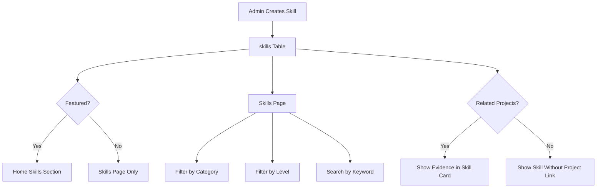
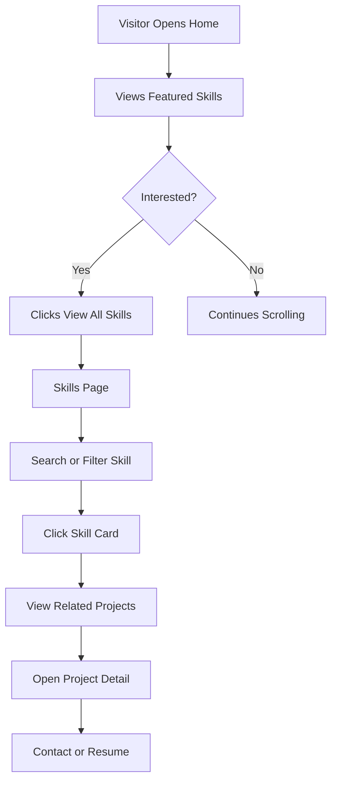

# skills-design.md

# Portfolio Skills Design System & Guideline

Dokumen ini menjelaskan rancangan **Skills Section** dan **Skills Page** untuk portfolio dinamis Frontend Engineer.

Tujuan utamanya adalah membuat skill kamu terlihat:

- Konsisten.
- Profesional.
- Mudah dipahami.
- Punya hierarchy yang kuat.
- Tidak hanya berupa kumpulan logo teknologi.
- Terhubung dengan bukti nyata seperti project dan case study.

Sekadar menampilkan 40 badge teknologi itu bukan strategi. Itu cuma menumpahkan isi `package.json` ke halaman web lalu berharap recruiter tercerahkan.

---

# 1. Tujuan Skills Section

Skills section harus menjawab:

```txt
Kamu ahli di bagian apa?
Teknologi apa yang paling kamu kuasai?
Skill mana yang paling relevan untuk Frontend Engineer?
Seberapa dalam kemampuanmu?
Project mana yang membuktikan skill tersebut?
```

Skills section bukan dekorasi. Skills section adalah bukti singkat kemampuan teknis.

---

# 2. Prinsip Utama

## 2.1 Clarity First

Visitor harus cepat memahami skill utama kamu.

Jangan buat semua skill terlihat sama penting.

Contoh hierarchy yang benar:

```txt
React
Next.js
TypeScript
Tailwind CSS
Component Architecture
Performance
Accessibility
```

Skill seperti Docker, Supabase, Drizzle, atau Tiptap tetap boleh ada, tapi sebagai supporting skill.

---

## 2.2 Strong Visual Hierarchy

Skill harus punya tingkatan visual.

Prioritas:

```txt
Primary Skill      = paling menonjol
Secondary Skill    = pendukung utama
Supporting Skill   = pelengkap workflow
Learning Skill     = sedang dikembangkan
```

Dengan begini, visitor tidak bingung membedakan mana core skill dan mana skill yang hanya pernah kamu sentuh sebentar lalu ditinggal seperti tab dokumentasi yang belum dibaca.

---

## 2.3 Evidence-Based Skill

Skill lebih kuat jika dikaitkan dengan project.

Contoh:

```txt
Next.js
Used in:
- Portfolio CMS
- Admin Dashboard
- Project Showcase
```

Ini lebih kredibel daripada hanya menulis “Next.js” dengan logo besar.

---

## 2.4 Avoid Fake Percentage

Hindari:

```txt
React 90%
Next.js 85%
TypeScript 80%
```

Masalahnya: 90% dari apa? Dari dokumentasi? Dari seluruh penderitaan production? Dari standar manusia yang suka bikin metrik tanpa arti?

Gunakan level berbasis konteks:

```txt
Exploring
Working Knowledge
Production Ready
Core Strength
```

---

# 3. Skill Category System

Gunakan kategori agar skill tidak terlihat berantakan.

Recommended categories:

```txt
Frontend Core
UI Engineering
State & Data Fetching
Styling & Design System
Backend Integration
Database
CMS & Content
Testing & Quality
Tooling & Workflow
Design Tools
Performance & SEO
```

---

# 4. Category Detail

## 4.1 Frontend Core

Skill utama untuk role Frontend Engineer.

Contoh:

```txt
HTML
CSS
JavaScript
TypeScript
React
Next.js
```

Treatment:

- Muncul di homepage.
- Muncul paling atas di skills page.
- Visual weight paling kuat.
- Bisa diberi label `Core`.

---

## 4.2 UI Engineering

Skill yang menunjukkan kemampuan membangun UI berkualitas.

Contoh:

```txt
Component Architecture
Responsive Design
Accessibility
Micro Interaction
Animation
Design System Implementation
```

Skill ini penting karena kamu ingin terlihat sebagai frontend engineer yang peduli kualitas interface, bukan sekadar orang yang bisa membuat button biru.

---

## 4.3 State & Data Fetching

Contoh:

```txt
TanStack Query
Zustand
React Hook Form
Server Actions
URL State
```

Deskripsi harus menjelaskan penggunaan nyata:

```txt
Used for server state, caching, async loading states, and dashboard data flows.
```

---

## 4.4 Styling & Design System

Contoh:

```txt
Tailwind CSS
shadcn/ui
CSS Variables
Design Tokens
Radix UI
Framer Motion
```

Skill ini harus dikaitkan dengan portfolio kamu karena kamu memang membangun dua mode design system.

---

## 4.5 Backend Integration

Contoh:

```txt
Supabase
REST API
Server Actions
Authentication Flow
File Upload
```

Untuk role Frontend Engineer, tampilkan sebagai supporting skill.

---

## 4.6 Database

Contoh:

```txt
PostgreSQL
Drizzle ORM
SQL Basics
Schema Design
Relations
```

Jangan terlalu mendominasi halaman skill, tapi tetap tampil karena portfolio kamu dinamis dan punya CMS.

---

## 4.7 CMS & Content

Contoh:

```txt
Tiptap Editor
Rich Text Rendering
Markdown/HTML Content
Draft & Publish Flow
Content Modeling
```

Ini relevan untuk admin CMS portfolio.

---

## 4.8 Testing & Quality

Contoh:

```txt
Type Safety
Zod Validation
ESLint
Prettier
Basic Testing
Playwright
Testing Library
```

Kalau testing belum terlalu kuat, jangan dilebih-lebihkan. Tampilkan sebagai learning atau working knowledge.

---

## 4.9 Tooling & Workflow

Contoh:

```txt
Git
GitHub
Vercel
pnpm
Docker Basic
CI/CD Basic
```

---

## 4.10 Design Tools

Contoh:

```txt
Figma
Wireframing
Typography
Color System
Layout Composition
Design Handoff
Interaction Design
```

Ini mendukung posisi kamu sebagai frontend yang design-aware.

---

## 4.11 Performance & SEO

Contoh:

```txt
Core Web Vitals
Image Optimization
Metadata API
Sitemap
SSR/SSG Strategy
Bundle Optimization
```

Bagian ini penting untuk membedakan kamu dari frontend yang hanya membuat animasi hover lalu merasa sudah mengalahkan internet.

---

# 5. Skill Level System

Gunakan level ini:

```txt
Exploring
Working Knowledge
Production Ready
Core Strength
```

## 5.1 Exploring

Untuk skill yang sedang dipelajari.

Contoh:

```txt
Playwright
Advanced CI/CD
Advanced Animation
```

## 5.2 Working Knowledge

Untuk skill yang bisa digunakan dalam task sederhana sampai menengah.

Contoh:

```txt
Supabase
Drizzle ORM
Tiptap
Framer Motion
```

## 5.3 Production Ready

Untuk skill yang sudah cukup kuat dipakai dalam project nyata.

Contoh:

```txt
TypeScript
Tailwind CSS
React Hook Form
Zod
```

## 5.4 Core Strength

Untuk skill utama yang paling relevan dengan identitas kamu.

Contoh:

```txt
React
Next.js
TypeScript
Component Architecture
UI Engineering
```

---

# 6. Skill Priority System

Selain level, tambahkan priority.

```txt
primary
secondary
supporting
learning
```

## 6.1 Primary

Skill utama.

```txt
React
Next.js
TypeScript
Tailwind CSS
Component Architecture
```

## 6.2 Secondary

Skill pendukung utama.

```txt
TanStack Query
React Hook Form
Zod
Framer Motion
shadcn/ui
```

## 6.3 Supporting

Skill pendukung workflow.

```txt
Supabase
PostgreSQL
Drizzle ORM
Git
Vercel
```

## 6.4 Learning

Skill yang sedang dikembangkan.

```txt
Testing Library
Playwright
Advanced Accessibility
CI/CD
```

---

# 7. Recommended Skill Data Structure

Tabel `skills` sebaiknya dibuat seperti ini:

```txt
skills
- id
- name
- slug
- category
- level
- priority
- icon_url
- short_description_id
- short_description_en
- long_description_id
- long_description_en
- years_of_experience
- featured
- sort_order
- created_at
- updated_at
```

Opsional untuk menghubungkan skill dengan project:

```txt
skill_projects
- id
- skill_id
- project_id
```

Kenapa perlu `priority`?

Karena level menjelaskan kemampuan, sedangkan priority menjelaskan seberapa penting skill itu untuk positioning kamu.

---

# 8. Homepage Skills Section

Homepage tidak boleh menampilkan semua skill.

Tampilkan hanya 6 sampai 8 skill paling penting.

Recommended featured skills:

```txt
React
Next.js
TypeScript
Tailwind CSS
Component Architecture
Accessibility
Performance Optimization
Design System
```

## 8.1 Homepage Layout

```txt
Section Label
Section Title
Short Description
Featured Skill Grid
CTA to Skills Page
```

## 8.2 Professional Mode Copy

Label:

```txt
Skills
```

Title:

```txt
Frontend tools I use to build polished web experiences.
```

Description:

```txt
A focused set of technologies and practices for building fast, accessible, and maintainable interfaces.
```

## 8.3 Playful Mode Copy

Label:

```txt
Toolbox
```

Title:

```txt
My favorite tools for making the web feel less boring.
```

Description:

```txt
A mix of frontend tools, design systems, motion, and performance habits that keep interfaces sharp and fun to use.
```

---

# 9. Full Skills Page

Skills page boleh lebih lengkap.

## 9.1 Page Structure

```txt
Page Header
Featured Skills
Category Filter
Skill Grid
Related Projects
Learning Roadmap
```

## 9.2 Professional Mode Layout

Use:

```txt
Editorial + structured grid
```

Structure:

```txt
[Page Header]

[Core Strengths]
Large cards, 2 columns

[All Skills]
Filter bar + grid

[Currently Improving]
Small section at bottom
```

Visual treatment:

- Background clean.
- Border subtle.
- Typography crisp.
- Spacing lega.
- Icon monochrome.
- Motion minimal.

## 9.3 Playful Mode Layout

Use:

```txt
Bento + toolbox style
```

Structure:

```txt
[Expressive Header]

[Toolbox Bento]
Large colorful cards for primary skills

[Filterable Skill Board]
Cards with bold border

[Learning Lab]
Playful section for skills being explored
```

Visual treatment:

- Background cream.
- Strong border.
- Offset shadow.
- Accent colors.
- Slight hover lift.
- Sticker label.

---

# 10. Skill Card Anatomy

Setiap skill card harus punya struktur konsisten.

```txt
┌──────────────────────────────┐
│ Icon                    Level │
│                              │
│ Skill Name                   │
│ Category                     │
│                              │
│ Short description            │
│                              │
│ Used in: Project A, Project B│
└──────────────────────────────┘
```

Required:

```txt
Icon
Name
Category
Level
Short description
```

Optional:

```txt
Related projects
Years of usage
Featured label
Learning status
```

---

# 11. Skill Card Variants

## 11.1 Compact Card

Untuk homepage atau related skill.

Isi:

```txt
Icon
Name
Category
```

## 11.2 Standard Card

Untuk skills page grid.

Isi:

```txt
Icon
Name
Category
Level
Short description
```

## 11.3 Featured Card

Untuk core strengths.

Isi:

```txt
Icon
Name
Category
Level
Description
Related projects
```

## 11.4 Learning Card

Untuk skill yang sedang dipelajari.

Isi:

```txt
Name
Current focus
Why learning this
Progress note
```

Tidak perlu progress bar palsu.

---

# 12. Visual Hierarchy Rules

## 12.1 Typography Size

```txt
Page title       40-64px
Section title    28-40px
Card title       18-22px
Body text        14-16px
Metadata         12-14px
```

## 12.2 Typography Weight

```txt
Page title       700
Section title    600/700
Card title       600
Body text        400/500
Metadata         400/500
```

## 12.3 Content Priority

Urutan visual dalam card:

```txt
1. Skill name
2. Level
3. Category
4. Description
5. Related project
```

---

# 13. Color Rules

## 13.1 Professional Mode

Gunakan warna netral.

```txt
Background       white / near black
Text             foreground
Muted text       muted foreground
Border           subtle
Accent           minimal
```

Category color jangan terlalu ramai. Professional mode harus terasa premium, bukan katalog stiker.

## 13.2 Playful Mode

Gunakan category color yang konsisten.

```txt
Frontend Core             #5B7CFA
UI Engineering            #FF6B6B
State & Data Fetching     #B8F7D4
Styling & Design System   #FFE66D
Backend Integration       #C8B6FF
Database                  #8DD7CF
CMS & Content             #FFB86B
Testing & Quality         #A7F3D0
Tooling & Workflow        #D9D9D9
Design Tools              #F9A8D4
Performance & SEO         #93C5FD
```

Rules:

- Warna dipakai untuk badge atau aksen kecil.
- Jangan membuat semua card full-color.
- Maksimal 2 warna dominan per section viewport.

---

# 14. Iconography Rules

Recommended sources:

```txt
Simple Icons
Lucide Icons
Custom monochrome icons
```

Professional mode:

- Icon monochrome.
- Ukuran 20-28px.
- Gunakan container kecil.
- Hindari logo brand warna-warni berlebihan.

Playful mode:

- Icon boleh berwarna.
- Ukuran 24-36px.
- Boleh pakai sticker-like container.
- Tetap jaga alignment.

Fallback:

```txt
TS
RQ
FM
NX
```

---

# 15. Spacing Rules

## 15.1 Section Spacing

Professional:

```txt
Top/bottom section: 80-120px
Header to content: 32-48px
Grid gap: 16-24px
Card padding: 20-28px
```

Playful:

```txt
Top/bottom section: 72-112px
Header to content: 32px
Grid gap: 20-28px
Card padding: 20-32px
```

## 15.2 Card Internal Spacing

```txt
Icon to title: 16px
Title to metadata: 4-8px
Metadata to description: 12-16px
Description to footer: 16-20px
```

---

# 16. Grid Rules

## 16.1 Homepage Skills Grid

Desktop:

```txt
4 columns
```

Tablet:

```txt
2 columns
```

Mobile:

```txt
1 column
```

## 16.2 Skills Page Grid

Desktop:

```txt
3 columns
```

Large desktop:

```txt
4 columns optional
```

Tablet:

```txt
2 columns
```

Mobile:

```txt
1 column
```

---

# 17. Filter & Search

Skills page sebaiknya punya:

```txt
Search
Category filter
Level filter
Priority filter optional
```

## 17.1 Professional Mode Filter

- Horizontal filter bar.
- Clean input.
- Pill filter.
- Subtle active state.
- No heavy animation.

## 17.2 Playful Mode Filter

- Toolbox-like filter panel.
- Bold border.
- Active filter with accent color.
- Slight hover motion.

---

# 18. Interaction Rules

## 18.1 Hover

Professional:

```txt
translateY(-2px)
border contrast increase
subtle shadow
no rotation
```

Playful:

```txt
translateY(-4px)
optional rotate(-1deg)
offset shadow increase
icon wiggle subtle
```

## 18.2 Active

Professional:

```txt
background muted
border strong
```

Playful:

```txt
pressed transform
shadow offset reduced
```

## 18.3 Focus

All modes:

```txt
clear focus ring
keyboard accessible
never remove outline without replacement
```

## 18.4 Reduced Motion

If `prefers-reduced-motion` is enabled:

```txt
disable rotate
disable wiggle
disable heavy motion
keep simple opacity/instant transitions
```

---

# 19. Content Writing Rules

## 19.1 Good Description

Good:

```txt
Used to build reusable UI components, structure page-level interfaces, and manage interactive states in production-ready web apps.
```

Bad:

```txt
I am expert in React.
```

Yang buruk itu cuma klaim. Yang bagus menjelaskan penggunaan.

## 19.2 Keep Description Short

Homepage:

```txt
1 sentence maximum
```

Skills page:

```txt
1-2 sentences maximum
```

Skill detail:

```txt
3-5 bullets maximum
```

## 19.3 Use Action-Oriented Words

Use:

```txt
Build
Structure
Optimize
Integrate
Validate
Design
Render
Manage
```

Avoid:

```txt
Know
Understand
Familiar with
```

Kecuali skill tersebut memang masih learning.

---

# 20. Recommended Skill List

## 20.1 Primary Skills

```txt
React
Next.js
TypeScript
Tailwind CSS
Component Architecture
Responsive Design
Accessibility
Performance Optimization
```

## 20.2 Secondary Skills

```txt
shadcn/ui
Framer Motion
TanStack Query
React Hook Form
Zod
Server Actions
CSS Variables
Design Tokens
```

## 20.3 Supporting Skills

```txt
Supabase
PostgreSQL
Drizzle ORM
Tiptap
Git
GitHub
Vercel
Docker Basic
```

## 20.4 Design-Aware Skills

```txt
Figma
Wireframing
Typography
Color System
Layout Composition
UI Consistency
Design Handoff
Interaction Design
```

## 20.5 Learning / Improving

```txt
Testing Library
Playwright
Advanced Accessibility
Advanced Animation
CI/CD
Observability
```

---

# 21. Example Skill Cards

## 21.1 React

```txt
React
Frontend Core
Core Strength

Used to build reusable, interactive, and maintainable UI components for modern web applications.
```

## 21.2 Next.js

```txt
Next.js
Frontend Core
Core Strength

Used for multi-page routing, server rendering, SEO, and performance-focused frontend architecture.
```

## 21.3 TypeScript

```txt
TypeScript
Frontend Core
Production Ready

Used to make frontend code safer, clearer, and easier to maintain as the application grows.
```

## 21.4 Tailwind CSS

```txt
Tailwind CSS
Styling & Design System
Production Ready

Used to build consistent, responsive interfaces with utility-first styling and design tokens.
```

## 21.5 shadcn/ui

```txt
shadcn/ui
Styling & Design System
Production Ready

Used as a flexible component foundation while keeping full control over styling and behavior.
```

## 21.6 TanStack Query

```txt
TanStack Query
State & Data Fetching
Working Knowledge

Used to manage server state, async data, caching, and loading states in dashboard-like interfaces.
```

## 21.7 Framer Motion

```txt
Framer Motion
UI Engineering
Working Knowledge

Used for purposeful transitions, micro-interactions, and playful UI experiments.
```

## 21.8 Supabase

```txt
Supabase
Backend Integration
Working Knowledge

Used for authentication, PostgreSQL data storage, file uploads, and admin CMS workflows.
```

## 21.9 Drizzle ORM

```txt
Drizzle ORM
Database
Working Knowledge

Used to model database schema and write type-safe queries for PostgreSQL.
```

## 21.10 Tiptap

```txt
Tiptap
CMS & Content
Working Knowledge

Used to build a WYSIWYG editor for managing rich content inside the admin CMS.
```

---

# 22. Empty State

Professional:

```txt
No skills found.
Try another keyword or category.
```

Playful:

```txt
No tool found in this drawer.
Try opening another category.
```

---

# 23. Loading State

Professional:

```txt
Skeleton cards
Neutral color
Subtle pulse
```

Playful:

```txt
Skeleton cards with bold border
Optional playful label
No heavy loading animation
```

---

# 24. Accessibility Rules

- Skill card clickable area must be clear.
- If card is clickable, use semantic link or button.
- Decorative icons use `aria-hidden`.
- Color cannot be the only category indicator.
- Level text must be visible.
- Filter controls must have labels.
- Keyboard navigation must work.
- Focus state must be visible.
- Motion must respect `prefers-reduced-motion`.

---

# 25. Performance Rules

- Use optimized icons.
- Avoid loading large icon packages unnecessarily.
- Use server-rendered skill data where possible.
- Do not make all skill cards client components.
- Filter can be client-side if skill count is small.
- Simple hover should use CSS, not JavaScript.
- Framer Motion only for playful interactive sections if needed.
- Do not load playground interaction code on skills page.

---

# 26. Admin Skill Management

## 26.1 Skill List Admin

Features:

```txt
Search skill
Filter category
Filter level
Filter priority
Sort order
Featured toggle
Edit
Delete/archive
```

## 26.2 Skill Form Fields

```txt
Name
Slug
Category
Level
Priority
Icon
Short description ID
Short description EN
Long description ID
Long description EN
Years of experience optional
Featured
Sort order
Related projects optional
```

## 26.3 Validation Rules

```txt
Name required
Slug required and unique
Category required
Level required
Priority required
Short description ID required
Short description EN required
Sort order number
Featured boolean
```

---

# 27. Mermaid Flow: Skills Data to UI



---

# 28. Mermaid Flow: Visitor Interaction



---

# 29. Design QA Checklist

## Content

- [ ] Skill categories are clear.
- [ ] Skill levels are meaningful.
- [ ] No fake percentage bars.
- [ ] Descriptions are action-oriented.
- [ ] Primary skills appear first.
- [ ] Skill copy is bilingual-ready.

## Visual

- [ ] Professional mode looks premium and minimal.
- [ ] Playful mode looks creative but readable.
- [ ] Card hierarchy is consistent.
- [ ] Spacing is consistent.
- [ ] Icons are aligned.
- [ ] Badge style is consistent.
- [ ] Typography hierarchy is clear.

## UX

- [ ] Search works.
- [ ] Filter works.
- [ ] Empty state exists.
- [ ] Mobile layout works.
- [ ] Related projects are visible if available.
- [ ] CTA to projects/contact exists.

## Accessibility

- [ ] Keyboard navigation works.
- [ ] Focus state visible.
- [ ] Contrast passes.
- [ ] Icons are not the only source of meaning.
- [ ] Motion respects reduced motion.

## Performance

- [ ] No unnecessary client component.
- [ ] Icons optimized.
- [ ] Animation scoped.
- [ ] No heavy libraries for simple hover.
- [ ] Public page remains fast.

---

# 30. Final Recommendation

Untuk portfolio ini, skills design terbaik adalah:

```txt
Homepage:
Show only 6-8 strongest frontend skills.

Skills Page:
Show full structured skill system with category, level, priority, and related projects.

Professional Mode:
Minimal, premium, clear, recruiter-friendly.

Playful Mode:
Toolbox-style, colorful, interactive, but still consistent.
```

Skill section yang bagus bukan yang paling banyak teknologinya. Skill section yang bagus adalah yang paling cepat membuat orang paham:

```txt
Orang ini kuat di frontend.
Orang ini paham UI.
Orang ini peduli performa.
Orang ini bisa bikin produk yang rapi.
```

Itu yang harus dikejar. Bukan menambahkan badge teknologi sampai halaman terlihat seperti rak minimarket.
